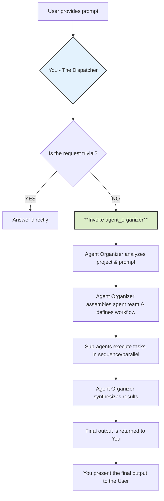
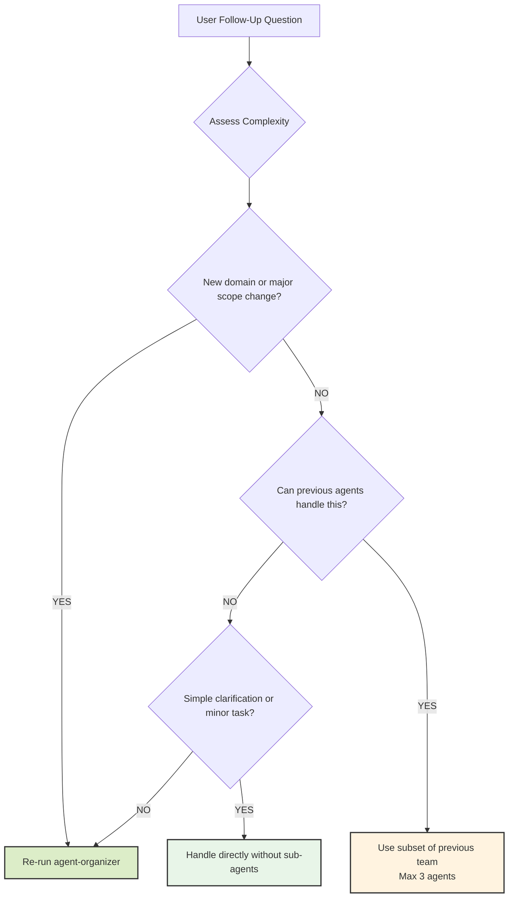

# CLAUDE.md

This file provides guidance to Claude Code (claude.ai/code) when working with code in this repository.

## Project Overview

This is an Odoo addon named "Awesome Dashboard" that integrates with Home Assistant to create a dashboard displaying IoT device data within Odoo. The addon fetches real-time sensor data from Home Assistant and presents it through custom views and charts.

## File Organization

```
odoo_ha_addon/
├── models/           # Backend models and business logic
│   ├── common/      # Shared utilities (API client, helpers)
│   └── *.py         # Entity models (ha_entity, ha_sensor, etc.)
├── controllers/     # HTTP controllers for API endpoints
├── views/           # XML view definitions
├── static/src/      # Frontend components (JS/XML)
│   ├── services/    # Service layer (ha_data_service, chart_service)
│   ├── actions/     # Action/page components
│   ├── views/       # View type implementations
│   ├── components/  # Reusable UI components
│   └── util/        # Shared utilities
├── tests/           # Test suites
│   └── e2e_tests/   # Playwright E2E tests for entity controllers
├── docs/            # Technical documentation
├── data/            # Initial data and menu definitions
└── security/        # Access rights and security rules
```

## Quick Reference

### API Response Format

All endpoints use: `{success: bool, data: dict, error: str}`

### Instance Selection Priority

```
1. Session -> 2. User Preference -> 3. First Accessible Instance
```

### Key Patterns

| Pattern               | Usage                                         |
| --------------------- | --------------------------------------------- |
| **Service-First**     | Use `useService("ha_data")`, never direct RPC |
| **Bus Notifications** | Use `bus_service.subscribe()`, NOT `useBus()` |
| **Reactive State**    | Use `useState()` + service callbacks          |
| **Chart Component**   | Use `UnifiedChart` for all new charts         |
| **Icon Usage**        | Font Awesome 4.x only (no FA5+ icons)         |

### i18n Quick Reference

| Location        | Method | Example              |
| --------------- | ------ | -------------------- |
| Python          | `_()`  | `_("Hello")`         |
| JavaScript/OWL  | `_t()` | `_t("Hello")`        |
| QWeb XML        | Auto   | `<span>Hello</span>` |
| XML string attr | Auto   | `string="Hello"`     |

See [i18n Development Guide](docs/guides/i18n-development.md) for complete patterns.

### Common Commands

```bash
# WebSocket service status (in Odoo shell)
env['ha.entity'].check_websocket_status()

# Restart WebSocket service
env['ha.entity'].restart_websocket_service()
```

## Documentation Index

**Main Index**: [docs/README.md](docs/README.md) - Complete documentation navigation

### Quick Start

- **[Quick Start Guide](docs/getting-started/quick-start.md)** - Get up and running in 5 minutes
- **[Architecture Overview](docs/getting-started/architecture-overview.md)** - High-level system design for beginners

### Architecture & Design

- **[Architecture Overview](docs/architecture/overview.md)** - Complete backend/frontend architecture
- **[Security](docs/architecture/security.md)** - Two-tier permission system
- **[Session Instance](docs/architecture/session-instance.md)** - Session-based instance architecture
- **[Instance Helper](docs/architecture/instance-helper.md)** - HAInstanceHelper (Single Source of Truth)
- **[Instance Switching](docs/architecture/instance-switching.md)** - Instance switching event handling
- **[WebSocket Subscription](docs/architecture/websocket-subscription.md)** - Real-time data subscription
- **[Bidirectional Sync](docs/architecture/bidirectional-sync.md)** - Area & Entity bidirectional sync mechanism
- **[Internationalization](docs/architecture/i18n.md)** - Multi-language support (100% zh_TW coverage)

### Development Guides

- **[Development Guide](docs/guides/development.md)** - Common patterns, uninstall hook, best practices
- **[Troubleshooting](docs/guides/troubleshooting.md)** - Common issues and solutions
- **[Bus Mechanisms](docs/guides/bus-mechanisms.md)** - useBus() vs bus_service comparison
- **[Device Control](docs/guides/device-control.md)** - Device control flow and patterns
- **[Custom Views](docs/guides/custom-views.md)** - HAHistory view implementation
- **[i18n Development](docs/guides/i18n-development.md)** - How to write translatable code

### Implementation Details

- **[Multi-Instance](docs/implementation/multi-instance/overview.md)** - Multi-instance implementation progress
- **[Phase 6 Report](docs/implementation/multi-instance/phase6-report.md)** - Test report (32 tests, 100% pass)
- **[i18n Implementation](docs/implementation/i18n/implementation.md)** - Multi-language implementation
- **[Features](docs/implementation/features/)** - Individual feature implementations

### Reference

- **[Odoo Model Types](docs/reference/odoo-model-types.md)** - Odoo model type guide
- **[Home Assistant API](docs/reference/home-assistant-api/)** - HA WebSocket and REST API docs

### Changelog

- **[2025-11 Changes](docs/changelog/2025-11.md)** - Recent architecture changes

### Which doc should I read?

| Role                   | Start with                                         | Then read                                                                                                                              |
| ---------------------- | -------------------------------------------------- | -------------------------------------------------------------------------------------------------------------------------------------- |
| **New Member**         | [Quick Start](docs/getting-started/quick-start.md) | [Architecture Overview](docs/getting-started/architecture-overview.md) → [Development Guide](docs/guides/development.md)               |
| **Backend Developer**  | [Architecture](docs/architecture/overview.md)      | [Session Instance](docs/architecture/session-instance.md) → [Instance Helper](docs/architecture/instance-helper.md)                    |
| **Frontend Developer** | [Architecture](docs/architecture/overview.md)      | [Instance Switching](docs/architecture/instance-switching.md) → [Bus Mechanisms](docs/guides/bus-mechanisms.md)                        |
| **Debugging**          | [Troubleshooting](docs/guides/troubleshooting.md)  | Session issues → [Instance Helper](docs/architecture/instance-helper.md), Bus issues → [Bus Mechanisms](docs/guides/bus-mechanisms.md) |

## Changelog

當修改 `CHANGELOG.md` 時，**必須同步修改** `CHANGELOG-tw.md`（繁體中文版）。

| 檔案              | 說明       |
| ----------------- | ---------- |
| `CHANGELOG.md`    | 英文版     |
| `CHANGELOG-tw.md` | 繁體中文版 |

## Troubleshooting

| Issue                              | Solution                                                                |
| ---------------------------------- | ----------------------------------------------------------------------- |
| **WebSocket Connection**           | Check HA API URL and token in Settings > Technical > Parameters         |
| **Python Dependencies**            | Missing `websockets` will auto-install via `pre_init_hook`              |
| **Frontend Errors**                | Check browser console and ensure service layer is loaded                |
| **Chart Performance**              | Use `ChartService.destroyChart()` before creating new instances         |
| **Bus Notifications Not Received** | Verify `/bus/websocket_worker_bundle` in Network tab, check Nginx proxy |

## E2E Testing with Playwright MCP

使用 Claude Code 的 Playwright MCP 進行 E2E 測試，無需安裝額外套件。

### 測試環境

administrator (ha_admin)

| Setting      | Value            |
| ------------ | ---------------- |
| **URL**      | http://localhost |
| **Database** | odoo             |
| **Username** | admin            |
| **Password** | admin            |

user (ha_user)

| Setting      | Value                   |
| ------------ | ----------------------- |
| **URL**      | http://localhost        |
| **Database** | odoo                    |
| **Username** | yujiechen0514@gmail.com |
| **Password** | 12341234                |

### 測試流程

1. **登入 Odoo**
   - 導航到 http://localhost/web/login
   - 填寫帳號密碼並登入

2. **進入 HA Dashboard**
   - 導航到 Dashboard 或 Entity 列表頁面

3. **測試 Entity Controllers**
   - 根據 domain 類型測試對應的控制元件
   - 有 entity_controller 和 portal_entity_controller 兩類要測試

### 支援的 Domain 測試

| Domain         | 測試項目             |
| -------------- | -------------------- |
| **switch**     | Toggle 開關          |
| **light**      | Toggle + 亮度滑桿    |
| **sensor**     | 唯讀數值顯示         |
| **climate**    | 溫度調整 + 風扇模式  |
| **cover**      | 開/關/停 + 位置滑桿  |
| **fan**        | Toggle + 風速 + 擺動 |
| **automation** | Toggle + 觸發        |
| **scene**      | 啟動按鈕             |
| **script**     | 執行 + Toggle        |

### Playwright MCP 常用工具

```
mcp__playwright__browser_navigate   - 導航到 URL
mcp__playwright__browser_snapshot   - 取得頁面快照（accessibility tree）
mcp__playwright__browser_click      - 點擊元素
mcp__playwright__browser_type       - 輸入文字
mcp__playwright__browser_fill_form  - 填寫表單
mcp__playwright__browser_evaluate   - 執行 JavaScript
```

### 測試資料

詳見 `tests/e2e_tests/e2e_config.yaml` 中的 `test_entities` 設定

## Recent Features

### Portal Sharing (share_entities)

Portal access for `ha.entity` and `ha.entity.group` via token-based sharing:

```python
# Models inherit portal.mixin
class HAEntity(models.Model):
    _inherit = [..., 'portal.mixin']

    def _compute_access_url(self):
        for record in self:
            record.access_url = f'/portal/entity/{record.id}'

    def action_share(self):
        """Open portal.share wizard"""
        self._portal_ensure_token()
        return {...}
```

**Portal Routes** (`controllers/portal.py`):

- `/portal/entity/<id>` - Entity portal page
- `/portal/entity_group/<id>` - Group portal page
- `/portal/entity/<id>/state` - JSON polling endpoint (5s refresh)

**Security**:

- Token validation uses `hmac.compare_digest()` (timing attack prevention)
- Field whitelists: `PORTAL_ENTITY_FIELDS`, `PORTAL_GROUP_FIELDS`
- `sudo()` bypasses `ha.current.instance.filter.mixin`

**Testing**:

- `tests/test_portal_mixin.py` - Unit tests
- `tests/test_portal_controller.py` - Integration tests
- `tests/test_share_permissions.py` - Permission tests

## Worktree Development

此專案支援 git worktree 並行測試，每個 worktree 可以獨立運行自己的 Docker 環境。

### 快速開始

```bash
# 1. 建立 worktree
git worktree add ../odoo_ha_addon.worktrees/epic-feature -b epic/feature

# 2. 切換到 worktree
cd ../odoo_ha_addon.worktrees/epic-feature

# 3. 自動設定環境並啟動
./scripts/start-dev.sh
```

### 環境配置

每個 worktree 會自動配置：

- **唯一的 port**（8069 + 目錄 hash）- 避免衝突
- **獨立的資料庫名稱**（`woow_<branch>`）- 資料隔離
- **獨立的 Docker 容器**（基於 `COMPOSE_PROJECT_NAME`）

所有配置透過 `.env` 檔案管理（由 `scripts/setup-worktree-env.sh` 自動生成）。

### 可用腳本

```bash
# 設定環境變數（.env）
./scripts/setup-worktree-env.sh

# 啟動開發環境
./scripts/start-dev.sh

# 執行測試
./scripts/test-addon.sh

# 清理環境
./scripts/cleanup-worktree.sh
```

### 並行測試範例

同時運行多個 worktree：

```bash
# Terminal 1 - 主專案
cd /path/to/odoo_ha_addon
./scripts/start-dev.sh
# → http://localhost:8069 (woow_main)

# Terminal 2 - Feature A
cd ../odoo_ha_addon.worktrees/epic-feature-a
./scripts/start-dev.sh
# → http://localhost:8234 (woow_epic_feature_a)

# Terminal 3 - Feature B
cd ../odoo_ha_addon.worktrees/fix-bug-123
./scripts/start-dev.sh
# → http://localhost:8501 (woow_fix_bug_123)
```

每個實例使用各自的資料庫，互不干擾。

### 共享 PostgreSQL（可選）

如果希望節省資源，可以讓所有 worktree 共享一個 PostgreSQL 容器：

```bash
# 1. 首次啟動共享資料庫（在主專案目錄執行一次）
docker compose -f docker-compose.shared-db.yml up -d

# 2. 在每個 worktree 設定環境（使用 --shared-db 參數）
./scripts/setup-worktree-env.sh --shared-db

# 3. 啟動（不會建立獨立的 PostgreSQL）
./scripts/start-dev.sh
```

### VS Code 本機開發

使用本機 VS Code（不使用 Dev Container）：

- 每個 worktree 可以開啟獨立的 VS Code 視窗
- Odoo 服務運行在 Docker 容器中
- 支援遠端調試（Python debugger attach to container）

推薦擴充套件已配置在 `.vscode/extensions.json`。

### 重要提醒

- **網址測試**：使用 http://localhost（不是 :8069）以啟用 websocket
- **自動配置**：環境變數由腳本自動生成，請勿手動修改 `.env`
- **資料庫名稱**：基於 branch 名稱，將 `/` 和 `-` 轉為 `_`
- **Port 範圍**：8069-9068（基於目錄路徑 hash 計算）

## Appendix

### HA Integration Docs

- **HA Integration Doc**: `docs/homeassistant-api/HA_串接文件/HA 串接文件.md`
- **WebSocket Guide**: `docs/homeassistant-api/homeasistant-websocket.md`

<!-- lst97 CLAUDE.md Start -->

# Full Stack Development Guidelines

## Philosophy

### Core Beliefs

- **Iterative delivery over massive releases** – Ship small, working slices of functionality from database to UI.
- **Understand before you code** – Explore both front-end and back-end patterns in the existing codebase.
- **Pragmatism over ideology** – Choose tools and architectures that serve the project's goals, not personal preference.
- **Readable code over clever hacks** – Optimize for the next developer reading your code, not for ego.

### Simplicity Means

- One clear responsibility per module, class, or API endpoint.
- Avoid premature frameworks, libraries, or abstractions.
- While latest and new technology is considerable, stable and efficient should be prioritized.
- If your integration flow diagram needs an explanation longer than 3 sentences, it's too complex.

---

## Process

### 1. Planning & Staging

Break work into 3–5 cross-stack stages (front-end, back-end, database, integration). Document in `IMPLEMENTATION_PLAN.md`:

```markdown
## Stage N: [Name]

**Goal**: [Specific deliverable across the stack]
**Success Criteria**: [User story + passing tests]
**Tests**: [Unit, integration, E2E coverage]
**Status**: [Not Started|In Progress|Complete]
```

- Update status after each merge.
- Delete the plan file after all stages are verified in staging and production.

### 2. Implementation Flow

- **Understand** – Identify existing patterns for UI, API, DB, and CI/CD.
- **Test First** – For back-end, write API integration tests; for front-end, write component/unit tests.
- **Implement Minimal** – Just enough code to pass all tests.
- **Refactor Safely** – Clean code with test coverage at 60%+ for changed areas.
- **Commit Clearly** – Reference plan stage, include scope (front-end, back-end, DB).

### 3. When Stuck (Max 3 Attempts)

- **Document Failures** – Include console logs, stack traces, API responses, and network traces.
- **Research Alternatives** – Compare similar solutions across different tech stacks.
- **Check Architecture Fit** – Could this be a UI-only change? A DB query rewrite? An API contract change?
- **Try a Different Layer** – Sometimes a front-end bug is a back-end response problem.

---

## Technical Standards

### Architecture

- Composition over inheritance for both UI components and service classes.
- Interfaces/contracts over direct calls – Use API specs and type definitions.
- Explicit data flow – Document request/response shapes in OpenAPI/Swagger.
- TDD when possible – Unit tests + integration tests for each feature slice.

### Code Quality

**Every commit must:**

- Pass linting, type checks, and formatting.
- Pass all unit, integration, and E2E tests.
- Include tests for new logic, both UI and API.

**Before committing:**

- Run formatter, linter, and security scans.
- Ensure commit messages explain _why_, not just _what_.

### Error Handling

- Fail fast with descriptive UI error messages and meaningful API status codes.
- Include correlation IDs in logs for tracing full-stack requests.
- Handle expected errors at the right layer; avoid silent catch blocks.

### Decision Framework

When multiple solutions exist, prioritize in this order:

1. **Testability** – Can UI and API behavior be tested in isolation?
2. **Readability** – Will another dev understand this in 6 months?
3. **Consistency** – Matches existing API/UI patterns?
4. **Simplicity** – Is this the least complex full-stack solution?
5. **Reversibility** – Can we swap frameworks/services easily?

## Project Integration

### Learning the Codebase

- Identify 3 similar features and trace the flow: UI → API → DB.
- Use the same frameworks, libraries, and test utilities.

### Tooling

- Use the project's existing CI/CD, build pipeline, and testing stack.
- No new tools unless approved via RFC with a migration plan.

## Quality Gates

### Definition of Done

- Tests pass at all levels (unit, integration, E2E).
- Code meets UI and API style guides.
- No console errors or warnings.
- No unhandled API errors in the UI.
- Commit messages follow semantic versioning rules.

### Test Guidelines

- **For UI:** Test user interactions and visible changes, not implementation details.
- **For APIs:** Test responses, status codes, and side effects.
- Keep tests deterministic and fast; use mocks/fakes where possible.

## Important Reminders

**NEVER:**

- Merge failing builds.
- Skip tests locally or in CI.
- Change API contracts without updating docs and front-end code.

**ALWAYS:**

- Ship vertical slices of functionality.
- Keep front-end, back-end, and database in sync.
- Update API docs when endpoints change.
- Log meaningful errors for both developers and support teams.

---

# Agent Dispatch Protocol (Follow once the Agent-Organizer sub agent being called or used)

## Philosophy

### Core Belief: Delegate, Don't Solve

- **Your purpose is delegation, not execution.** You are the central command that receives a request and immediately hands it off to a specialized mission commander (`agent-organizer`).
- **Structure over speed.** This protocol ensures every complex task is handled with a structured, robust, and expert-driven approach, leveraging the full capabilities of specialized sub-agents.
- **Clarity of responsibility.** By dispatching tasks, you ensure the right virtual agent with the correct skills is assigned to the job, leading to a higher quality outcome.

### Mental Model: The Workflow You Initiate

Understanding your role is critical. You are the starting point for a larger, more sophisticated process.



---

## Process

### 1. Triage the Request

Analyze the user's prompt to determine if it requires delegation.

**Delegation is MANDATORY if the prompt involves:**

- **Code Generation:** Writing new files, classes, functions, or significant blocks of code.
- **Refactoring:** Modifying or restructuring existing code.
- **Debugging:** Investigating and fixing bugs beyond simple syntax errors.
- **Analysis & Explanation:** Being asked to "understand," "analyze," or "explain" a project, file, or codebase.
- **Adding Features:** Implementing any new functionality.
- **Writing Tests:** Creating unit, integration, or end-to-end tests.
- **Documentation:** Generating or updating API docs, READMEs, or code comments.
- **Strategy & Planning:** Requests for roadmaps, tech-debt evaluation, or architectural suggestions.

### 2. Execute the Dispatch

If the request meets the criteria above, your sole action is to call the `agent_organizer` tool with the user's prompt.

### 3. Await Completion

Once you have invoked the `agent-organizer`, your role becomes passive. You must wait for the `agent-organizer` to complete its entire workflow and return a final, consolidated output.

---

## Follow-Up Question Handling Protocol

When users ask follow-up questions, apply intelligent escalation based on complexity to avoid unnecessary overhead while maintaining quality.

### Complexity Assessment Framework

- **Simple Follow-ups (Handle Directly):**
  - Clarification questions about previous work ("What does this function do?").
  - Minor modifications ("Can you fix this typo?").
  - Single-step tasks taking less than 5 minutes.

- **Moderate Follow-ups (Use Previously Identified Agents):**
  - Building on existing work within the same domain ("Add error handling to this API").
  - Extending or refining previous deliverables ("Make the UI more responsive").
  - Tasks requiring 1-3 of the previously selected agents.

- **Complex Follow-ups (Re-run `agent-organizer`):**
  - New requirements spanning multiple domains ("Now add authentication and deploy to AWS").
  - Significant scope changes ("Actually, let's make this a mobile app instead").
  - Tasks requiring different expertise than previously identified.

### Follow-Up Decision Tree



---

## Important Reminders

**NEVER:**

- Attempt to solve a complex project or coding request on your own.
- Interfere with the `agent-organizer`'s process or try to "help" the sub-agents.
- Modify or add commentary to the final output returned by the `agent-organizer`.

**ALWAYS:**

- Delegate to the `agent-organizer` if a prompt is non-trivial or if you are in doubt.
- Present the final, complete output from the `agent-organizer` directly to the user.
- Use the Follow-Up Decision Tree to handle subsequent user questions efficiently.

---

### Example Scenario

**User Prompt:** "This project is a mess. Can you analyze my Express.js API, create documentation for it, and refactor the `userController.js` file to be more efficient?"

**Your Internal Monologue and Action:**

1. **Analyze Prompt:** The user is asking for analysis, documentation creation, and code refactoring.
2. **Check Delegation Criteria:** This hits at least three mandatory triggers. This is a non-trivial task.
3. **Apply Core Philosophy:** My role is to dispatch, not to solve. I must invoke the `agent-organizer`.
4. **Execute Dispatch:** Run the `agent_organizer` sub-agent with the user's prompt.
5. **Await Completion:** My job is now done until the organizer returns the complete result. I will then present that result to the user.

<!-- lst97 CLAUDE.md End -->
