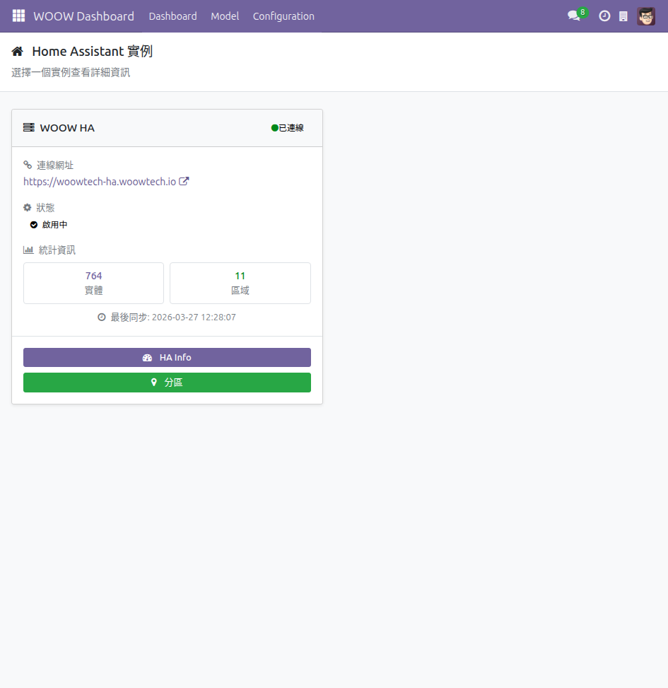
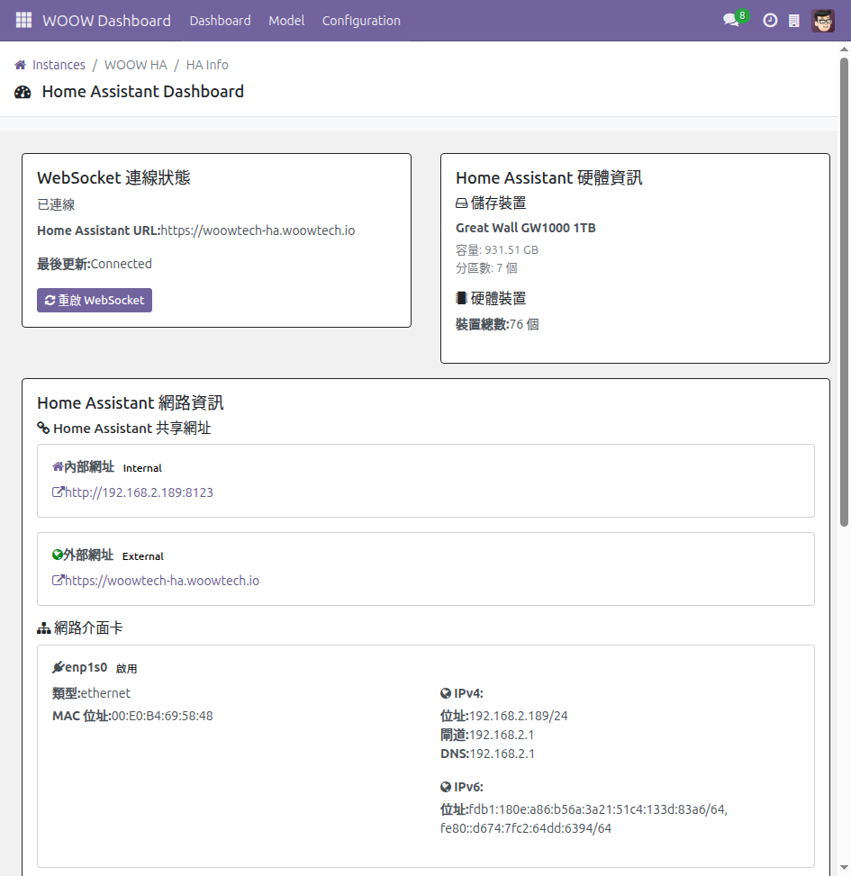
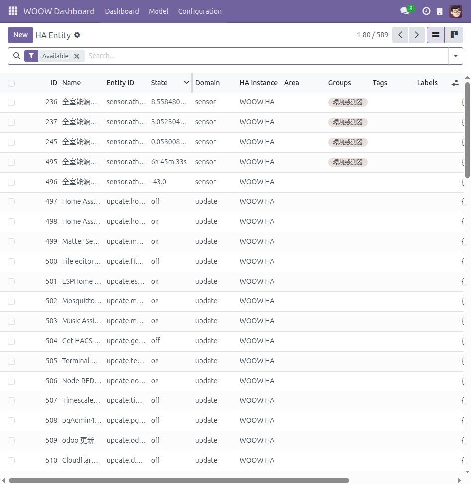
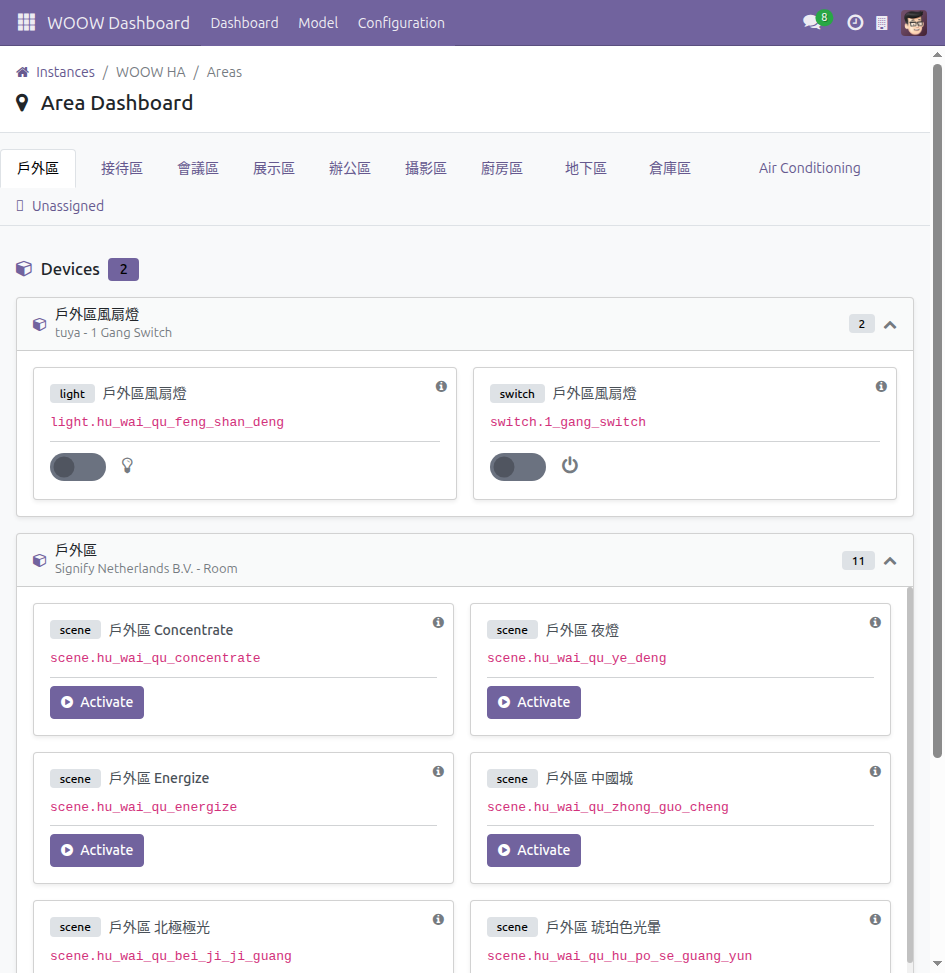
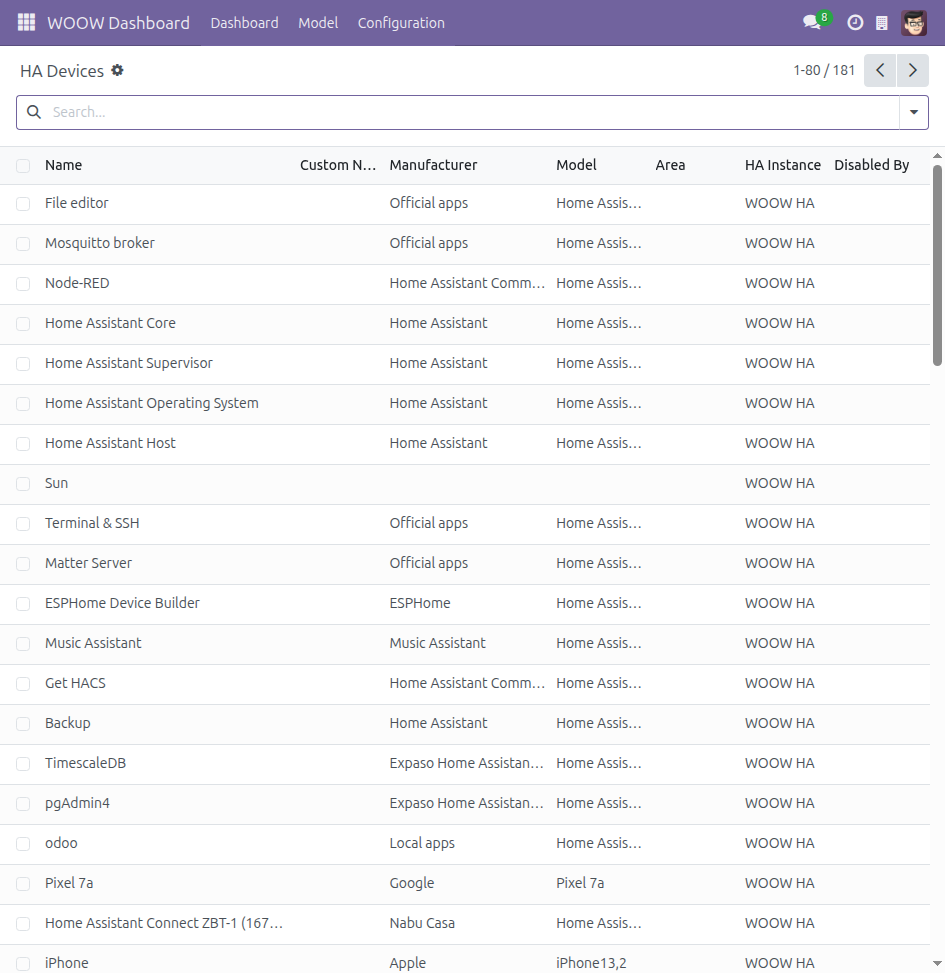
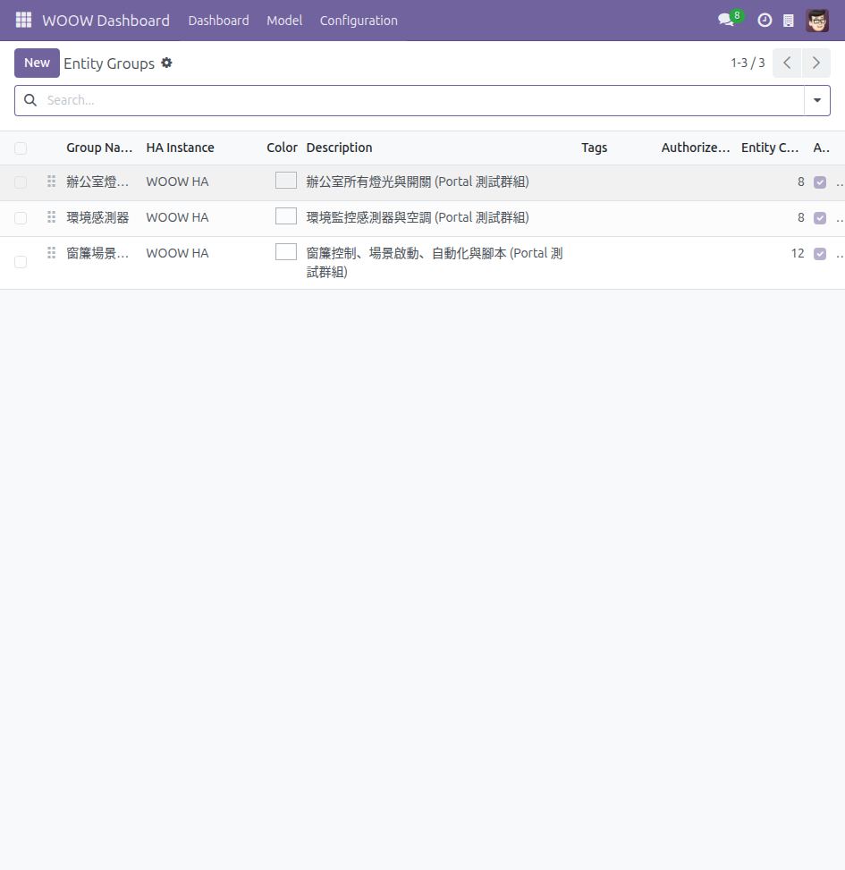
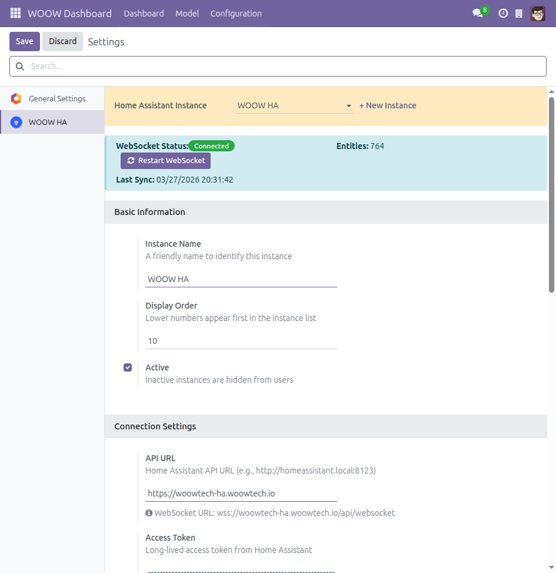

[English](#english) | [繁體中文](#繁體中文)

---

# English

<h1 align="center">WOOW Dashboard</h1>

<p align="center">
  <strong>Home Assistant Integration for Odoo ERP</strong>
</p>

<p align="center">
  <code>Version 18.0.6.2</code>&nbsp;&nbsp;|&nbsp;&nbsp;
  <code>Odoo 18</code>&nbsp;&nbsp;|&nbsp;&nbsp;
  <code>LGPL-3</code>&nbsp;&nbsp;|&nbsp;&nbsp;
  <code>Home Assistant</code>
</p>

<p align="center">
  <a href="https://github.com/WOOWTECH/odoo-addon-odoo-ha-addon">GitHub Repository</a>
</p>

---

## Overview

WOOW Dashboard bridges **Home Assistant** and **Odoo ERP**, bringing real-time IoT device monitoring, control, and sharing into your business management platform. It connects to one or more Home Assistant instances via WebSocket and REST API, synchronizes entities, areas, and devices, and exposes them through Odoo's backend views and portal pages.

Whether you manage a smart office, a fleet of industrial sensors, or a building automation system, WOOW Dashboard lets your team monitor and control IoT devices without leaving Odoo -- and share device access with external users through a secure portal.

## Key Features

- **Home Assistant Integration** -- Real-time bidirectional communication via WebSocket and REST API with automatic reconnection and state synchronization.
- **Multi-Instance Support** -- Connect and manage multiple Home Assistant instances from a single Odoo installation. Session-based instance selection with user preference persistence.
- **Entity Management & Control** -- Full control for 10 device domains: switch, light, sensor, climate, cover, fan, automation, scene, script, and a generic fallback.
- **Area & Device Management** -- Bidirectional sync of areas and devices from Home Assistant. Visual area dashboard with device cards and embedded entity controllers.
- **Glances System Monitoring** -- View Home Assistant host system metrics (CPU, memory, disk, network) directly within Odoo through Glances integration.
- **Portal Sharing** -- Share entities and entity groups with portal users. User-based permissions with configurable access levels (read-only or full control) and optional expiry dates.
- **Real-time Updates** -- Home Assistant state changes stream through the Odoo Bus bridge to connected browser sessions, providing instant UI updates without polling.
- **Internationalization** -- Full Traditional Chinese (zh_TW) translation coverage. All backend and portal interfaces support multi-language display.
- **Blueprint Wizard** -- Create Home Assistant automations from blueprints with a guided form wizard directly in Odoo.
- **Custom Views** -- Purpose-built Odoo views including entity history timeline, entity kanban with real-time state, and area dashboard with device-first layout.

## Screenshots

### Backend (Admin)

| Screenshot | Description |
|:---:|---|
|  | **Instance Dashboard** -- Entry page showing connected HA instances with entity, area, and device counts. Quick access to all management views. |
|  | **HA Info Dashboard** -- System information panel with WebSocket connection status, hardware details, and Glances monitoring widgets. |
|  | **Entity List** -- All synchronized entities with real-time state display, domain filtering, and batch operations. |
|  | **Area Dashboard** -- Device cards organized by Home Assistant areas, each showing embedded entity controllers for direct interaction. |
|  | **Device List** -- All Home Assistant devices with manufacturer, model, and firmware information. |
|  | **Entity Groups** -- Custom entity grouping with tag-based organization for logical device management. |
|  | **Settings** -- WebSocket configuration, connection parameters, entity sync status, and instance management. |

### Portal (User)

| Screenshot | Description |
|:---:|---|
|  | **Portal Home** -- User's Odoo portal landing page with WOOW Dashboard section showing shared instance summary. |
|  | **Instance List** -- Shared Home Assistant instances with entity, group, and device counts available to the portal user. |
|  | **Instance Detail** -- Shared entities and groups for a specific instance, with permission level badges and access indicators. |
|  | **Entity Control** -- Full device control interface on the portal. Shown: light entity with brightness slider and state toggle. |
|  | **Entity Group** -- Group view displaying entities in a responsive card grid with individual controllers. |
|  | **Sensor View** -- Read-only sensor display with current value, unit of measurement, and device attributes. |

## Architecture

```
+-------------------+         +------------------+         +------------------+
|   Browser (OWL)   |  <--->  |   Odoo Server    |  <--->  |  Home Assistant   |
+-------------------+         +------------------+         +------------------+
| OWL Components    |         | Models           |         | WebSocket API    |
| ha_data_service   |  RPC    | ha_entity        |  WS/    | REST API         |
| ha_bus_bridge     | <-----> | ha_instance      |  REST   | State Machine    |
| Entity Controllers|         | ha_area/device   | <-----> |                  |
| Chart Service     |         | HA API Client    |         |                  |
+-------------------+         +------------------+         +------------------+
        ^                             |
        |      Odoo Bus Bridge        |
        +-----------------------------+
        (Real-time state propagation)
```

- **Backend**: Odoo models communicate with Home Assistant through a dedicated API client supporting both WebSocket subscriptions and REST calls.
- **Frontend**: OWL components consume data through a service layer (`ha_data_service`) that handles RPC calls to the backend, caching, and reactive state management.
- **Real-time**: A WebSocket bridge subscribes to Home Assistant state changes and relays them through the Odoo Bus to all connected browser sessions.
- **Portal**: Dedicated controllers serve portal pages with token-validated access, fetching entity state through the same backend API client.

## Installation

### From Source

This repository **is** the Odoo addon. Clone or download it directly into your Odoo addons directory:

```bash
# Clone into your Odoo addons path, renaming to odoo_ha_addon
git clone https://github.com/WOOWTECH/odoo-addon-odoo-ha-addon.git \
  /path/to/odoo/addons/odoo_ha_addon

# Or download and extract the ZIP from GitHub Releases
```

Then in Odoo:

1. Go to **Apps** and click **Update Apps List**
2. Search for and install **WOOW Dashboard**

> The Python dependency `websockets` is automatically installed via the `pre_init_hook` -- no manual pip install is required.

### Using Docker (Development)

```bash
# Clone the repository
git clone https://github.com/WOOWTECH/odoo-addon-odoo-ha-addon.git
cd odoo-addon-odoo-ha-addon

# Set up environment
cp .env.example .env

# Start services
docker compose up -d

# Access Odoo at http://localhost:8069
```

## Configuration

1. Navigate to **Settings** > **WOOW HA**
2. Click **Add Instance** and enter:
   - **Name**: A descriptive label for the Home Assistant instance
   - **URL**: Home Assistant base URL (e.g., `http://homeassistant.local:8123`)
   - **Access Token**: A [Long-Lived Access Token](https://developers.home-assistant.io/docs/auth_api/#long-lived-access-token) generated in Home Assistant
3. Click **Test Connection** to verify connectivity
4. Click **Sync Entities** to import entities, areas, and devices

## Requirements

| Component | Version |
|---|---|
| Odoo | 18.0+ (Community or Enterprise) |
| Home Assistant | 2024.1+ |
| Python | 3.10+ |
| websockets | Auto-installed |

### Odoo Module Dependencies

- `base`
- `web`
- `mail`
- `portal`

## Project Structure

This repository is a standard Odoo addon. Clone it as `odoo_ha_addon` into your addons path.

```
odoo_ha_addon/                   # ← This repo (clone as odoo_ha_addon)
├── __manifest__.py              # Odoo module manifest
├── __init__.py                  # Python package init
├── models/                      # Backend models & business logic
│   ├── common/                  # Shared utilities (API client, helpers)
│   ├── ha_instance.py           # HA instance management
│   ├── ha_entity.py             # Entity model & WebSocket sync
│   ├── ha_area.py               # Area bidirectional sync
│   ├── ha_device.py             # Device management
│   ├── ha_entity_share.py       # Portal sharing model
│   └── ...                      # Other models
├── controllers/                 # HTTP & portal controllers
├── views/                       # XML view definitions & templates
├── static/src/                  # Frontend (OWL components, JS, SCSS)
│   ├── services/                # Service layer (ha_data, chart, bus bridge)
│   ├── actions/                 # Client action pages
│   ├── views/                   # Custom view types (hahistory, entity_kanban)
│   ├── components/              # Reusable UI components
│   ├── portal/                  # Portal-specific components
│   └── hooks/                   # Shared hooks (entity control)
├── security/                    # Access rights & record rules
├── data/                        # Initial data, menus, cron jobs
├── i18n/                        # Translation files (zh_TW)
├── wizard/                      # Wizard views
├── tests/                       # Unit, integration & E2E tests
├── docs/                        # Technical documentation & screenshots
├── scripts/                     # Development automation scripts
├── config/                      # Docker & Nginx configuration
├── docker-compose.yml           # Docker development environment
└── CHANGELOG.md                 # Release history
```

## Supported Entity Domains

| Domain | Capabilities |
|---|---|
| **switch** | Toggle on/off |
| **light** | Toggle, brightness, color temperature |
| **sensor** | Read-only value display with attributes |
| **climate** | Temperature target, HVAC mode, fan mode |
| **cover** | Open, close, stop, position slider |
| **fan** | Toggle, speed control, oscillation |
| **automation** | Toggle enable/disable, manual trigger |
| **scene** | Activate scene |
| **script** | Execute, toggle on/off |
| **generic** | Basic state display for unsupported domains |

## Contributing

Contributions are welcome. Please follow these guidelines:

1. Fork the repository
2. Create a feature branch (`git checkout -b feature/your-feature`)
3. Commit your changes with clear messages
4. Ensure all tests pass
5. Submit a pull request

For development setup details, see the [Development Guide](docs/guides/development.md).

## License

This project is licensed under the **GNU Lesser General Public License v3.0 (LGPL-3)**.

See the [LICENSE](https://www.gnu.org/licenses/lgpl-3.0.html) file for details.

## Credits

Developed and maintained by **[WOOWTECH](https://github.com/WOOWTECH)**.

---
---

# 繁體中文

<h1 align="center">WOOW Dashboard</h1>

<p align="center">
  <strong>Odoo ERP 的 Home Assistant 整合模組</strong>
</p>

<p align="center">
  <code>版本 18.0.6.2</code>&nbsp;&nbsp;|&nbsp;&nbsp;
  <code>Odoo 18</code>&nbsp;&nbsp;|&nbsp;&nbsp;
  <code>LGPL-3</code>&nbsp;&nbsp;|&nbsp;&nbsp;
  <code>Home Assistant</code>
</p>

<p align="center">
  <a href="https://github.com/WOOWTECH/odoo-addon-odoo-ha-addon">GitHub 儲存庫</a>
</p>

---

## 概述

WOOW Dashboard 將 **Home Assistant** 與 **Odoo ERP** 無縫整合，讓您在企業管理平台中即時監控、操作與分享 IoT 裝置。模組透過 WebSocket 與 REST API 連接一個或多個 Home Assistant 實例，同步實體、區域與裝置資料，並透過 Odoo 後台介面與入口網站（Portal）呈現給使用者。

無論您管理的是智慧辦公室、工業感測器群組，還是樓宇自動化系統，WOOW Dashboard 都能讓您的團隊在 Odoo 內直接監控和操作 IoT 裝置，並透過安全的 Portal 機制將裝置存取權限分享給外部使用者。

## 主要功能

- **Home Assistant 整合** -- 透過 WebSocket 與 REST API 進行即時雙向通訊，支援自動重連與狀態同步。
- **多實例管理** -- 在單一 Odoo 安裝中連接並管理多個 Home Assistant 實例。支援基於 Session 的實例切換與使用者偏好記憶。
- **實體管理與控制** -- 完整支援 10 種裝置類型：開關、燈光、感測器、空調、窗簾、風扇、自動化、場景、腳本，以及通用類型。
- **區域與裝置管理** -- 與 Home Assistant 雙向同步區域和裝置資料。視覺化區域儀表板以裝置卡片呈現，並嵌入實體控制器。
- **Glances 系統監控** -- 在 Odoo 內直接查看 Home Assistant 主機的系統指標（CPU、記憶體、磁碟、網路），透過 Glances 整合實現。
- **Portal 分享機制** -- 將實體與實體群組分享給 Portal 使用者。支援使用者層級的權限管理，可設定唯讀或完整控制，並支援到期日設定。
- **即時更新** -- Home Assistant 的狀態變化透過 Odoo Bus Bridge 串流至瀏覽器，無需輪詢即可即時更新介面。
- **多語系支援** -- 完整的繁體中文（zh_TW）翻譯覆蓋率。後台與 Portal 介面皆支援多語系顯示。
- **Blueprint 精靈** -- 透過引導式表單，在 Odoo 中直接從 Blueprint 建立 Home Assistant 自動化。
- **自訂視圖** -- 專為 IoT 設計的 Odoo 視圖，包含實體歷史時間軸、即時狀態看板，以及以裝置為中心的區域儀表板。

## 畫面截圖

### 後台管理介面

| 截圖 | 說明 |
|:---:|---|
|  | **實例儀表板** -- 入口頁面，顯示已連線的 HA 實例及其實體、區域、裝置數量，可快速導覽至各管理頁面。 |
|  | **HA 資訊儀表板** -- 系統資訊面板，顯示 WebSocket 連線狀態、硬體資訊與 Glances 監控元件。 |
|  | **實體列表** -- 所有已同步的實體，即時顯示狀態，支援依類型篩選與批次操作。 |
|  | **區域儀表板** -- 依 Home Assistant 區域分類的裝置卡片，每張卡片內嵌實體控制器，可直接互動。 |
|  | **裝置列表** -- 所有 Home Assistant 裝置，顯示製造商、型號與韌體資訊。 |
|  | **實體群組** -- 自訂實體分組，透過標籤進行邏輯化的裝置管理。 |
|  | **設定** -- WebSocket 連線設定、實例參數、實體同步狀態與管理功能。 |

### Portal 使用者介面

| 截圖 | 說明 |
|:---:|---|
|  | **Portal 首頁** -- 使用者的 Odoo Portal 登入頁，包含 WOOW Dashboard 區塊及已分享實例摘要。 |
|  | **實例列表** -- 已分享的 Home Assistant 實例，顯示可存取的實體、群組與裝置數量。 |
|  | **實例詳情** -- 特定實例中已分享的實體與群組，附帶權限等級標示與存取指示。 |
|  | **實體控制** -- Portal 上的完整裝置控制介面。圖示：燈光實體，含亮度滑桿與開關切換。 |
|  | **實體群組** -- 群組檢視，以響應式卡片網格呈現實體，每張卡片附有獨立控制器。 |
|  | **感測器檢視** -- 唯讀的感測器顯示頁面，包含當前數值、量測單位與裝置屬性。 |

## 系統架構

```
+-------------------+         +------------------+         +------------------+
|  瀏覽器 (OWL)     |  <--->  |   Odoo 伺服器    |  <--->  |  Home Assistant   |
+-------------------+         +------------------+         +------------------+
| OWL 元件          |         | Models           |         | WebSocket API    |
| ha_data_service   |  RPC    | ha_entity        |  WS/    | REST API         |
| ha_bus_bridge     | <-----> | ha_instance      |  REST   | State Machine    |
| Entity Controllers|         | ha_area/device   | <-----> |                  |
| Chart Service     |         | HA API Client    |         |                  |
+-------------------+         +------------------+         +------------------+
        ^                             |
        |     Odoo Bus Bridge         |
        +-----------------------------+
        (即時狀態傳播)
```

- **後端**：Odoo 模型透過專屬的 API Client 與 Home Assistant 通訊，同時支援 WebSocket 訂閱與 REST 呼叫。
- **前端**：OWL 元件透過服務層（`ha_data_service`）消費資料，處理 RPC 呼叫、快取與響應式狀態管理。
- **即時更新**：WebSocket Bridge 訂閱 Home Assistant 的狀態變化，並透過 Odoo Bus 轉發至所有已連線的瀏覽器 Session。
- **Portal**：專屬控制器提供 Portal 頁面，透過 Token 驗證存取權限，並經由相同的後端 API Client 取得實體狀態。

## 安裝方式

### 從原始碼安裝

本儲存庫本身**即為** Odoo 模組。直接 Clone 或下載至您的 Odoo addons 目錄即可使用：

```bash
# Clone 到 Odoo addons 路徑，重新命名為 odoo_ha_addon
git clone https://github.com/WOOWTECH/odoo-addon-odoo-ha-addon.git \
  /path/to/odoo/addons/odoo_ha_addon

# 或從 GitHub Releases 下載 ZIP 並解壓縮
```

然後在 Odoo 中：

1. 前往 **應用程式**，點選 **更新應用程式列表**
2. 搜尋並安裝 **WOOW Dashboard**

> Python 相依套件 `websockets` 會透過 `pre_init_hook` 自動安裝，無需手動執行 pip install。

### 使用 Docker（開發環境）

```bash
# 複製儲存庫
git clone https://github.com/WOOWTECH/odoo-addon-odoo-ha-addon.git
cd odoo-addon-odoo-ha-addon

# 設定環境
cp .env.example .env

# 啟動服務
docker compose up -d

# 存取 Odoo：http://localhost:8069
```

## 設定說明

1. 前往 **設定** > **WOOW HA**
2. 點選 **新增實例**，填入以下資訊：
   - **名稱**：Home Assistant 實例的描述性標籤
   - **URL**：Home Assistant 的基礎網址（例如 `http://homeassistant.local:8123`）
   - **存取權杖**：在 Home Assistant 中產生的[長期存取權杖](https://developers.home-assistant.io/docs/auth_api/#long-lived-access-token)
3. 點選 **測試連線** 以驗證連線狀態
4. 點選 **同步實體** 以匯入實體、區域與裝置

## 系統需求

| 元件 | 版本 |
|---|---|
| Odoo | 18.0+（Community 或 Enterprise） |
| Home Assistant | 2024.1+ |
| Python | 3.10+ |
| websockets | 自動安裝 |

### Odoo 模組相依性

- `base`
- `web`
- `mail`
- `portal`

## 專案結構

本儲存庫即為標準 Odoo 模組。Clone 後重新命名為 `odoo_ha_addon` 放入 addons 路徑即可。

```
odoo_ha_addon/                   # ← 本儲存庫（Clone 後命名為 odoo_ha_addon）
├── __manifest__.py              # Odoo 模組描述檔
├── __init__.py                  # Python 套件初始化
├── models/                      # 後端模型與商業邏輯
│   ├── common/                  # 共用工具（API Client、Helper）
│   ├── ha_instance.py           # HA 實例管理
│   ├── ha_entity.py             # 實體模型與 WebSocket 同步
│   ├── ha_area.py               # 區域雙向同步
│   ├── ha_device.py             # 裝置管理
│   ├── ha_entity_share.py       # Portal 分享模型
│   └── ...                      # 其他模型
├── controllers/                 # HTTP 與 Portal 控制器
├── views/                       # XML 視圖定義與模板
├── static/src/                  # 前端（OWL 元件、JS、SCSS）
│   ├── services/                # 服務層（ha_data、chart、bus bridge）
│   ├── actions/                 # Client Action 頁面
│   ├── views/                   # 自訂視圖類型（hahistory、entity_kanban）
│   ├── components/              # 可重用 UI 元件
│   ├── portal/                  # Portal 專屬元件
│   └── hooks/                   # 共用 Hooks（實體控制）
├── security/                    # 存取權限與記錄規則
├── data/                        # 初始資料、選單、排程任務
├── i18n/                        # 翻譯檔案（zh_TW）
├── wizard/                      # 精靈視圖
├── tests/                       # 單元、整合與 E2E 測試
├── docs/                        # 技術文件與截圖
├── scripts/                     # 開發自動化腳本
├── config/                      # Docker 與 Nginx 設定
├── docker-compose.yml           # Docker 開發環境
└── CHANGELOG.md                 # 版本更新紀錄
```

## 支援的實體類型

| 類型 | 功能 |
|---|---|
| **switch**（開關） | 開啟/關閉切換 |
| **light**（燈光） | 開關切換、亮度調整、色溫控制 |
| **sensor**（感測器） | 唯讀數值顯示與屬性 |
| **climate**（空調） | 目標溫度、空調模式、風扇模式 |
| **cover**（窗簾） | 開啟、關閉、停止、位置滑桿 |
| **fan**（風扇） | 開關切換、風速控制、擺動 |
| **automation**（自動化） | 啟用/停用切換、手動觸發 |
| **scene**（場景） | 啟動場景 |
| **script**（腳本） | 執行、開關切換 |
| **generic**（通用） | 基本狀態顯示，適用於未支援的類型 |

## 貢獻指南

歡迎提交貢獻。請遵循以下流程：

1. Fork 此儲存庫
2. 建立功能分支（`git checkout -b feature/your-feature`）
3. 以清晰的訊息提交變更
4. 確保所有測試通過
5. 提交 Pull Request

開發環境設定詳情，請參閱[開發指南](docs/guides/development.md)。

## 授權條款

本專案採用 **GNU 較寬鬆通用公共授權條款 v3.0（LGPL-3）** 授權。

詳情請參閱 [LICENSE](https://www.gnu.org/licenses/lgpl-3.0.html)。

## 開發團隊

由 **[WOOWTECH](https://github.com/WOOWTECH)** 開發與維護。
