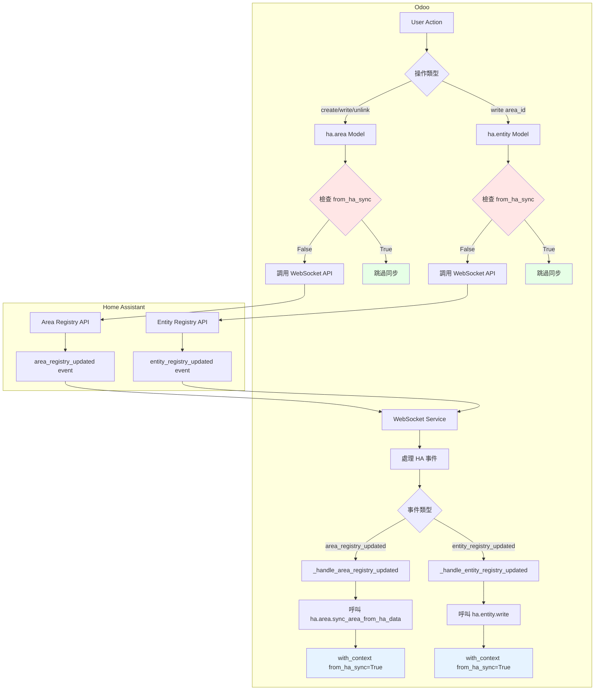
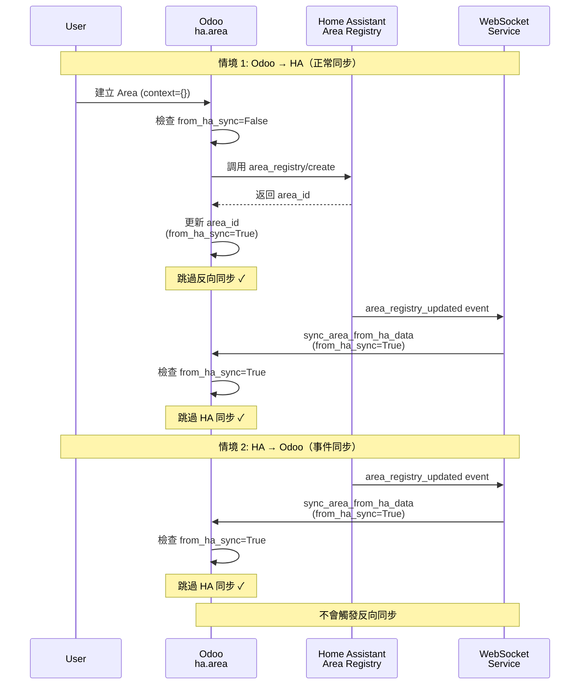
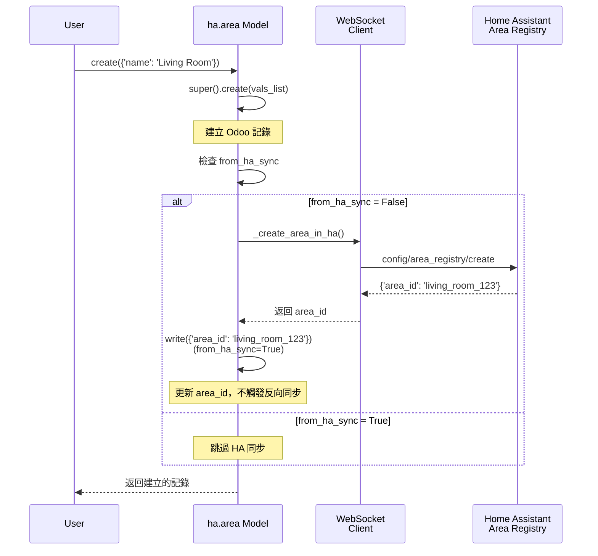
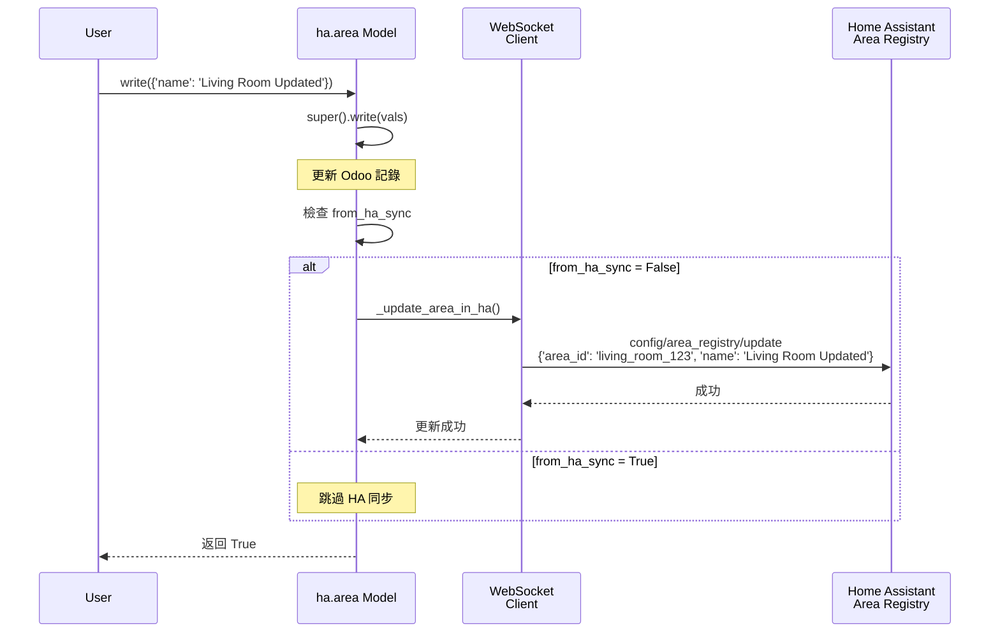
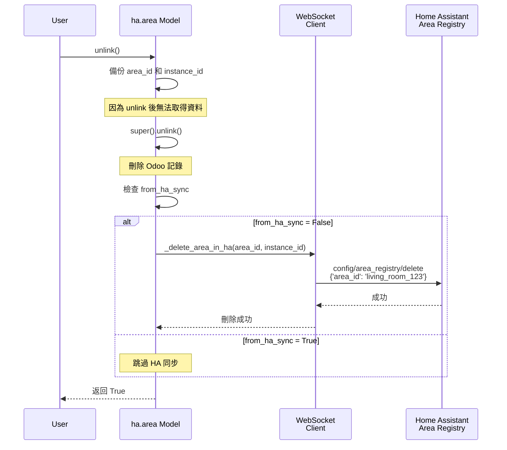
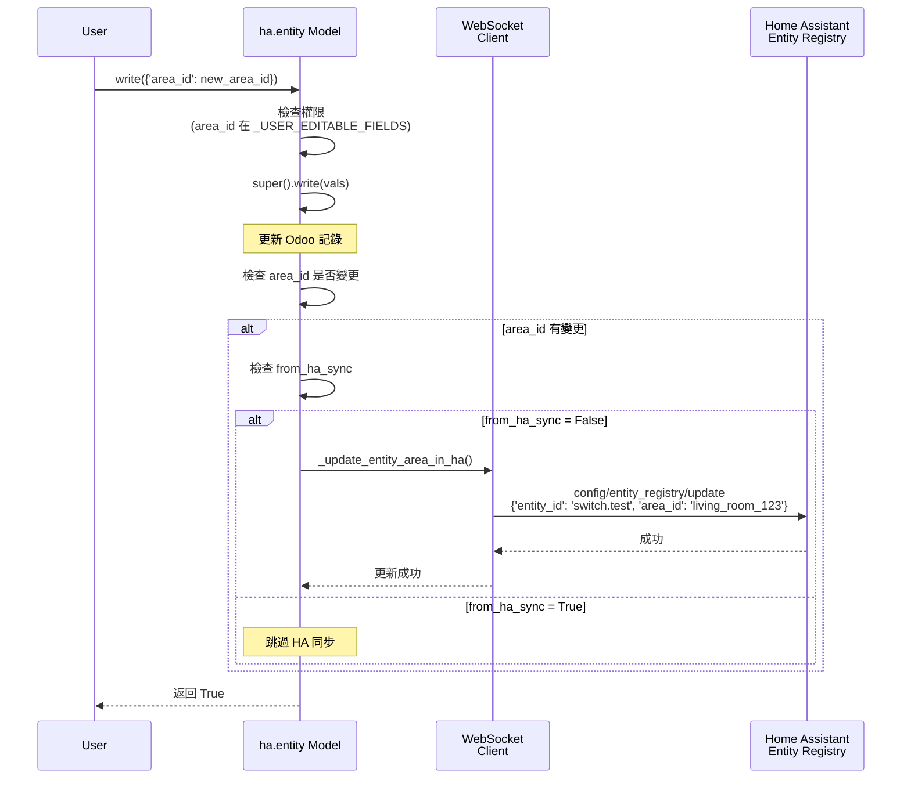
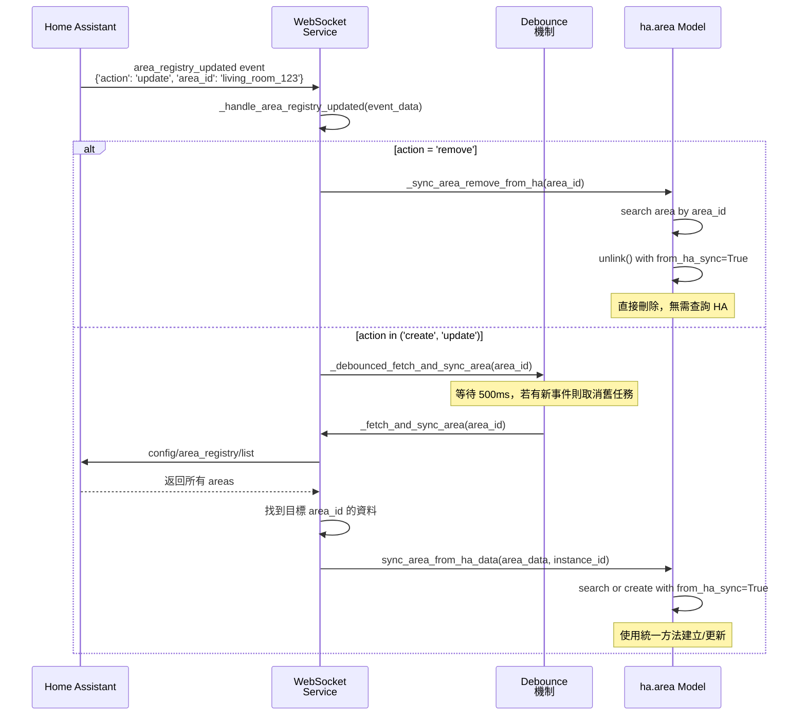
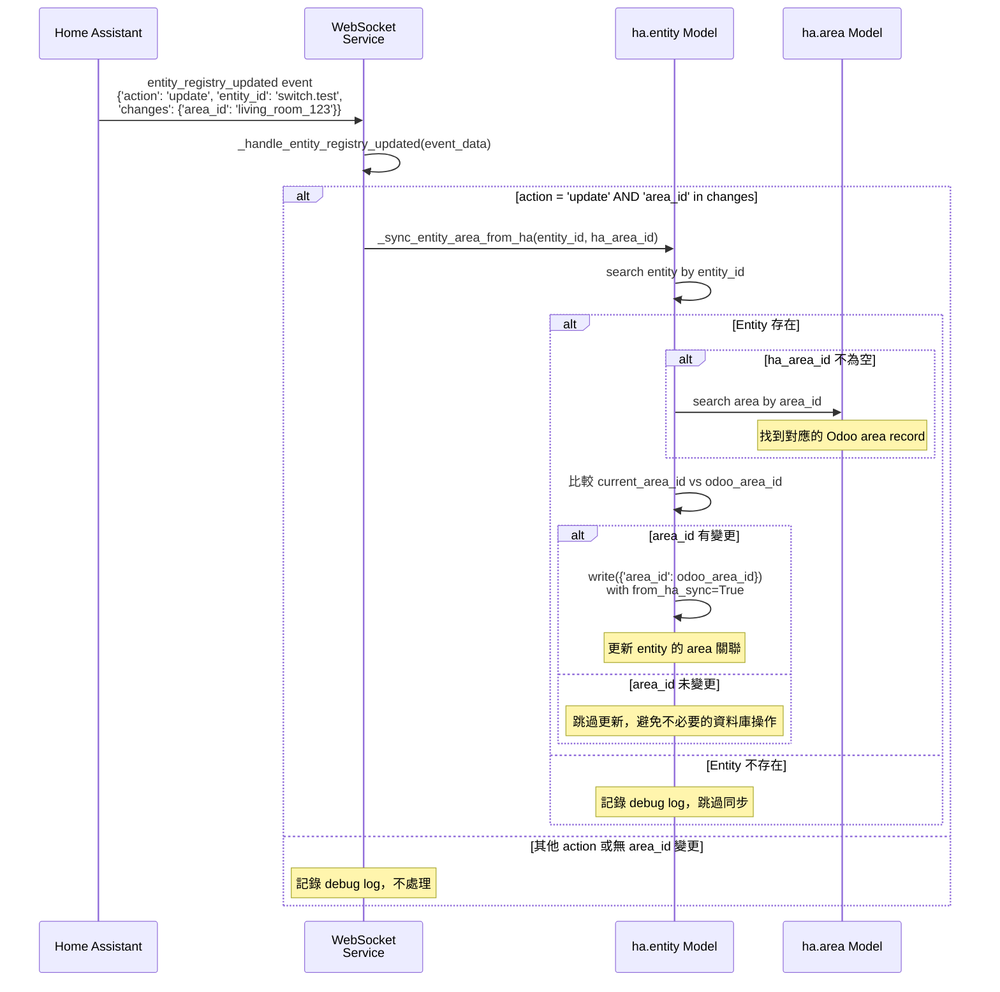
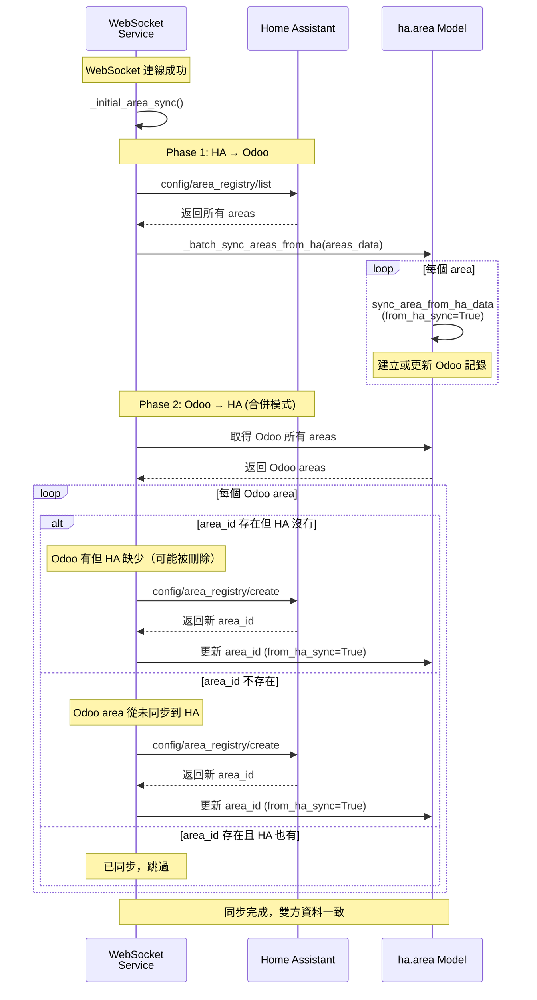

# 雙向同步機制技術文件

## 概述

本文件說明 Odoo HA Addon 中 Area 和 Entity 雙向同步機制的完整實現，包括 Odoo 與 Home Assistant 之間的即時資料同步，以及如何使用 `from_ha_sync` context 防止循環同步。

### 同步對象

- **Area (ha.area)**：區域資料的雙向同步
- **Entity (ha.entity)**：實體 area_id 欄位的雙向同步

### 同步方向

1. **Odoo → HA**：當用戶在 Odoo 中建立、更新、刪除 Area 或修改 Entity 的 area_id 時，自動同步到 Home Assistant
2. **HA → Odoo**：當 Home Assistant 中的 Area 或 Entity 註冊資料變更時，透過 WebSocket 事件即時推送到 Odoo

### 核心機制

- **Context 防循環**：使用 `from_ha_sync=True` context 標記來自 HA 的同步操作，防止觸發反向同步
- **WebSocket 訂閱**：訂閱 `area_registry_updated` 和 `entity_registry_updated` 事件，接收 HA 端的變更通知
- **Debounce 機制**：對於建立/更新事件，使用 500ms debounce 避免重複同步
- **初始同步**：WebSocket 連線建立後，執行雙向合併同步，確保資料一致性

---

## 雙向同步架構

### 整體架構圖



### 循環同步防護機制



---

## from_ha_sync Context 防循環機制

### 原理說明

`from_ha_sync` 是一個 Odoo context 標記，用於標識當前操作來自 Home Assistant 的同步，而非用戶直接操作。這個機制防止雙向同步造成的無限循環。

### 工作流程

```
┌─────────────────────────────────────────────────────────────┐
│  雙向同步循環防護機制                                           │
└─────────────────────────────────────────────────────────────┘

情境 1: 用戶在 Odoo 操作
────────────────────────
1. 用戶建立 Area (context={})
2. ha.area.create() 檢查 from_ha_sync
   → from_ha_sync=False，執行 Odoo→HA 同步
3. HA 返回 area_id
4. 更新 Odoo area_id (from_ha_sync=True)
   → from_ha_sync=True，跳過 Odoo→HA 同步 ✓

5. HA 發送 area_registry_updated 事件
6. WebSocket 收到事件
7. 調用 sync_area_from_ha_data (from_ha_sync=True)
   → from_ha_sync=True，跳過 Odoo→HA 同步 ✓

情境 2: HA 端變更
────────────────────────
1. HA 中 Area 被更新
2. HA 發送 area_registry_updated 事件
3. WebSocket 收到事件
4. 調用 sync_area_from_ha_data (from_ha_sync=True)
5. ha.area.write() 檢查 from_ha_sync
   → from_ha_sync=True，跳過 Odoo→HA 同步 ✓
```

### 實作細節

#### ha.area 模型中的使用

```python
def create(self, vals_list):
    """建立 Area 後同步到 HA"""
    records = super().create(vals_list)

    # 檢查 from_ha_sync context
    if not self.env.context.get('from_ha_sync'):
        for record in records:
            record._create_area_in_ha()  # 執行 Odoo→HA 同步

    return records

def write(self, vals):
    """更新 Area 後同步到 HA"""
    result = super().write(vals)

    # 檢查 from_ha_sync context
    if not self.env.context.get('from_ha_sync'):
        for record in self:
            record._update_area_in_ha()  # 執行 Odoo→HA 同步

    return result

def unlink(self):
    """刪除 Area 前同步到 HA"""
    areas_to_delete = [(r.area_id, r.ha_instance_id.id, r.name) for r in self]
    result = super().unlink()

    # 檢查 from_ha_sync context
    if not self.env.context.get('from_ha_sync'):
        for area_id, instance_id, name in areas_to_delete:
            if area_id:
                self._delete_area_in_ha(area_id, instance_id)

    return result
```

#### WebSocket Service 中的使用

```python
def _sync_area_create_or_update_from_ha(self, area_data):
    """從 HA 同步 Area 到 Odoo"""
    with db.db_connect(self.db_name).cursor() as cr:
        env = api.Environment(cr, 1, {})

        # 使用 from_ha_sync 標記，防止觸發 Odoo→HA 同步
        action, area = env['ha.area'].sync_area_from_ha_data(
            area_data, self.instance_id
        )
        cr.commit()

def _sync_area_remove_from_ha(self, area_id):
    """從 Odoo 刪除 Area"""
    with db.db_connect(self.db_name).cursor() as cr:
        env = api.Environment(cr, 1, {})

        existing_area = env['ha.area'].sudo().search([
            ('area_id', '=', area_id),
            ('ha_instance_id', '=', self.instance_id)
        ], limit=1)

        if existing_area:
            # 使用 from_ha_sync 防止循環同步
            existing_area.with_context(from_ha_sync=True).unlink()
            cr.commit()
```

---

## Odoo → HA 同步流程

### Create 操作



**關鍵步驟：**

1. **建立記錄**：先在 Odoo 中建立 Area 記錄
2. **檢查 Context**：檢查 `from_ha_sync` 是否為 True
3. **調用 HA API**：若為 False，調用 `config/area_registry/create` 建立 HA Area
4. **更新 area_id**：HA 返回 area_id 後，使用 `from_ha_sync=True` context 更新 Odoo 記錄
5. **防止循環**：更新 area_id 時設置 `from_ha_sync=True`，避免再次觸發 HA 同步

### Write 操作



**關鍵步驟：**

1. **更新記錄**：先在 Odoo 中更新 Area 記錄
2. **檢查 Context**：檢查 `from_ha_sync` 是否為 True
3. **調用 HA API**：若為 False，調用 `config/area_registry/update` 更新 HA Area
4. **防止循環**：如果 context 中有 `from_ha_sync=True`，則跳過 HA 同步

### Unlink 操作



**關鍵步驟：**

1. **備份資料**：先備份 area_id 和 instance_id（刪除後無法取得）
2. **刪除記錄**：在 Odoo 中刪除 Area 記錄
3. **檢查 Context**：檢查 `from_ha_sync` 是否為 True
4. **調用 HA API**：若為 False 且有 area_id，調用 `config/area_registry/delete` 刪除 HA Area
5. **防止循環**：如果 context 中有 `from_ha_sync=True`，則跳過 HA 同步

### Entity area_id 同步



---

## HA → Odoo 同步流程

### WebSocket 事件訂閱

在 `HassWebSocketService` 連線建立時，自動訂閱兩個註冊變更事件：

```python
# 訂閱 Area 註冊變更事件
area_registry_message = {
    'id': self._get_next_id(),
    'type': 'subscribe_events',
    'event_type': 'area_registry_updated'
}
await websocket.send(json.dumps(area_registry_message))

# 訂閱 Entity 註冊變更事件（用於 entity area_id 同步）
entity_registry_message = {
    'id': self._get_next_id(),
    'type': 'subscribe_events',
    'event_type': 'entity_registry_updated'
}
await websocket.send(json.dumps(entity_registry_message))
```

### Area Registry 事件處理



**事件格式：**

```json
{
  "action": "create" | "update" | "remove",
  "area_id": "living_room_123"
}
```

**處理流程：**

1. **接收事件**：WebSocket Service 收到 `area_registry_updated` 事件
2. **判斷 Action**：
   - **remove**：直接在 Odoo 中刪除對應的 Area（使用 `from_ha_sync=True`）
   - **create/update**：使用 debounce 機制，避免快速連續事件
3. **Debounce 處理**：
   - 若 500ms 內同一 area_id 有新事件，取消舊任務
   - 等待 500ms 後，執行實際同步
4. **查詢完整資料**：調用 `config/area_registry/list` 取得 HA 所有 areas，找到目標 area
5. **同步到 Odoo**：調用 `sync_area_from_ha_data` 統一方法，建立或更新 Odoo 記錄

### Entity Registry 事件處理



**事件格式：**

```json
{
  "action": "create" | "update" | "remove",
  "entity_id": "switch.test_switch",
  "changes": {
    "area_id": "living_room_123"
  }
}
```

**處理流程：**

1. **接收事件**：WebSocket Service 收到 `entity_registry_updated` 事件
2. **判斷 Action**：只處理 `action='update'` 且 `changes` 中包含 `area_id` 的情況
3. **查找 Entity**：在 Odoo 中查找對應的 `ha.entity` 記錄
4. **查找 Area**：根據 HA 的 `area_id` 字串，查找對應的 Odoo `ha.area` 記錄
5. **比較變更**：檢查 Entity 的 `area_id` 是否真的有變更
6. **同步到 Odoo**：若有變更，使用 `from_ha_sync=True` context 更新 Entity 的 `area_id`

---

## Debounce 機制

### 目的

避免快速連續的 HA 事件造成重複的 API 呼叫和資料庫寫入，提升系統效率和穩定性。

### 實作原理

```python
async def _debounced_fetch_and_sync_area(self, area_id: str):
    """
    Debounce 版本的 area 同步

    同一 area_id 在 500ms 內的多次呼叫只會執行最後一次
    """
    # 如果已有該 area 的待處理 task，取消它
    if area_id in self._pending_area_syncs:
        self._pending_area_syncs[area_id].cancel()
        self._logger.debug(f"Cancelled pending sync for area {area_id} (debounce)")

    # 建立新的 debounced task
    async def delayed_sync():
        try:
            await asyncio.sleep(self._area_sync_debounce_delay)  # 500ms
            # 從 pending 中移除
            self._pending_area_syncs.pop(area_id, None)
            # 執行實際同步
            await self._fetch_and_sync_area(area_id)
        except asyncio.CancelledError:
            # 被新事件取消，正常情況
            pass

    task = asyncio.create_task(delayed_sync())
    self._pending_area_syncs[area_id] = task
```

### 工作流程

```
時間軸：
────────────────────────────────────────────────────────
t=0ms    : 收到 area_id=A 的 update 事件
         : 建立 Task A，等待 500ms

t=100ms  : 收到 area_id=A 的 update 事件
         : 取消 Task A
         : 建立 Task A'，等待 500ms

t=200ms  : 收到 area_id=A 的 update 事件
         : 取消 Task A'
         : 建立 Task A''，等待 500ms

t=700ms  : Task A'' 執行，呼叫 _fetch_and_sync_area(A)
         : 從 HA 取得最新資料並同步到 Odoo
────────────────────────────────────────────────────────

結果：3 個事件只執行 1 次同步，大幅減少 API 呼叫和資料庫操作
```

### 優點

1. **減少 API 呼叫**：快速連續的事件只觸發一次 HA API 查詢
2. **減少資料庫操作**：避免重複的寫入操作
3. **獲取最新狀態**：debounce 後取得的是最新的 area 資料
4. **提升穩定性**：減少系統負載，避免併發寫入衝突

---

## 初始同步邏輯

### 觸發時機

當 `HassWebSocketService` 成功連線到 Home Assistant 時，自動執行初始同步。

### 雙向合併模式



### 執行步驟

1. **Phase 1: HA → Odoo**
   - 調用 `config/area_registry/list` 取得 HA 所有 areas
   - 批次同步到 Odoo（建立或更新）
   - 使用 `from_ha_sync=True` 避免觸發反向同步

2. **Phase 2: Odoo → HA（合併模式）**
   - 取得 Odoo 中該 instance 的所有 areas
   - 比對 Odoo 和 HA 的 area_id
   - 將 Odoo 有但 HA 沒有的 areas 推送到 HA
   - 更新 Odoo 的 area_id（使用 `from_ha_sync=True`）

3. **完成同步**
   - 雙方資料達成一致
   - 後續透過 WebSocket 事件維持同步

### 合併模式的優點

- **資料不丟失**：Odoo 和 HA 的資料都會保留
- **自動修復**：若 HA 被重置，Odoo 的資料會自動推送回去
- **雙向協調**：確保雙方都有完整的資料

---

## 統一同步方法

### sync_area_from_ha_data

這是 HA → Odoo 同步的**唯一入口點**，確保同步邏輯的一致性。

```python
@api.model
def sync_area_from_ha_data(self, area_data, instance_id):
    """
    統一方法：從 HA 資料同步單一 Area 到 Odoo

    這是 HA → Odoo 同步的唯一入口點，被以下方法呼叫：
    - WebSocket 事件處理
    - 初始同步（批次）
    - 手動同步

    Args:
        area_data: HA 回傳的 area 資料 dict
        instance_id: HA 實例 ID

    Returns:
        tuple: (action, area_record) - action 為 'created', 'updated' 或 None
    """
    area_id = area_data.get('area_id')
    if not area_id:
        return None, None

    values = {
        'area_id': area_id,
        'name': area_data.get('name', ''),
        'aliases': area_data.get('aliases', []),
        'picture': area_data.get('picture'),
        'icon': area_data.get('icon'),
        'floor_id': area_data.get('floor_id'),
        'labels': area_data.get('labels', []),
        'ha_instance_id': instance_id,
    }

    existing_area = self.sudo().search([
        ('area_id', '=', area_id),
        ('ha_instance_id', '=', instance_id)
    ], limit=1)

    # 使用 from_ha_sync 防止循環同步
    if existing_area:
        existing_area.with_context(from_ha_sync=True).write(values)
        return 'updated', existing_area
    else:
        new_area = self.sudo().with_context(from_ha_sync=True).create(values)
        return 'created', new_area
```

### 為什麼需要統一方法？

1. **一致性**：所有 HA → Odoo 的同步都經過同一個方法，確保邏輯一致
2. **可維護性**：只需在一個地方修改同步邏輯
3. **測試性**：單一入口點易於測試和驗證
4. **防止遺漏**：確保所有同步操作都有 `from_ha_sync=True` context

### 呼叫來源

```
sync_area_from_ha_data (統一入口點)
  ↑
  ├─ _sync_area_create_or_update_from_ha (WebSocket 事件處理)
  │   └─ _fetch_and_sync_area (debounce 後執行)
  │       └─ _debounced_fetch_and_sync_area (事件觸發)
  │           └─ _handle_area_registry_updated (WebSocket 事件)
  │
  └─ _batch_sync_areas_from_ha (初始同步)
      └─ _initial_area_sync (WebSocket 連線成功)
```

---

## 最佳實踐和注意事項

### 1. Context 使用原則

✅ **正確做法：**

```python
# 從 HA 同步到 Odoo 時，永遠使用 from_ha_sync=True
area.with_context(from_ha_sync=True).write({'name': 'New Name'})
area.sudo().with_context(from_ha_sync=True).create(values)
area.with_context(from_ha_sync=True).unlink()
```

❌ **錯誤做法：**

```python
# 不要在從 HA 同步時忘記設置 context
area.write({'name': 'New Name'})  # 會觸發 Odoo→HA 同步！

# 不要在用戶操作時設置 from_ha_sync=True
area.with_context(from_ha_sync=True).write(vals)  # 不會同步到 HA！
```

### 2. area_id 欄位處理

- **area_id 是 HA 自動生成的**：建立 Area 時不要手動設置 area_id
- **area_id 是只讀的**：使用 `readonly=True` 防止用戶修改
- **更新 area_id 要使用 context**：從 HA 回傳的 area_id 要使用 `from_ha_sync=True` 更新

```python
# 在 _create_area_in_ha 中
result = client.call_websocket_api_sync('config/area_registry/create', payload)
if result and isinstance(result, dict):
    ha_area_id = result.get('area_id')
    if ha_area_id and ha_area_id != self.area_id:
        # 使用 from_ha_sync 避免循環
        self.with_context(from_ha_sync=True).write({'area_id': ha_area_id})
```

### 3. Unlink 操作的資料備份

在 `unlink()` 之前必須先備份需要的資料，因為刪除後無法取得：

```python
def unlink(self):
    # 先備份 area_id 和 instance_id 用於 HA API 呼叫
    areas_to_delete = [(r.area_id, r.ha_instance_id.id, r.name) for r in self]

    result = super().unlink()

    # 使用備份的資料呼叫 HA API
    if not self.env.context.get('from_ha_sync'):
        for area_id, instance_id, name in areas_to_delete:
            if area_id:
                self._delete_area_in_ha(area_id, instance_id)

    return result
```

### 4. 錯誤處理

- **捕捉例外**：所有 HA API 呼叫都要包在 try-except 中
- **記錄錯誤**：使用 `_logger.error()` 記錄詳細錯誤資訊
- **不中斷流程**：同步失敗不應影響 Odoo 操作的成功

```python
if not self.env.context.get('from_ha_sync'):
    for record in self:
        try:
            record._update_area_in_ha()
        except Exception as e:
            _logger.error(f"Failed to sync area update {record.name} to HA: {e}")
            # 不要 raise，讓其他記錄繼續同步
```

### 5. Debounce 時間設置

- **預設 500ms**：適合大多數情況
- **可調整**：根據實際需求調整 `_area_sync_debounce_delay`
- **不要太短**：太短會失去 debounce 效果
- **不要太長**：太長會延遲用戶看到變更

### 6. 權限管理

- **使用 sudo()**：WebSocket Service 在背景執行，需要使用 `sudo()` 取得權限
- **檢查權限**：在 model 的 write 方法中檢查用戶權限

```python
# 在 ha.entity 的 write 方法中
def write(self, vals):
    if not self.env.su:
        disallowed_fields = set(vals.keys()) - self._USER_EDITABLE_FIELDS
        if disallowed_fields:
            raise AccessError(
                _('You do not have permission to modify the following fields: %s') %
                ', '.join(sorted(disallowed_fields))
            )
    # ...
```

### 7. 測試同步機制

**測試 Odoo → HA 同步：**

```python
# 在 Odoo 中建立 Area
area = env['ha.area'].create({
    'name': 'Test Area',
    'ha_instance_id': instance_id
})
# 檢查 area.area_id 是否有值（從 HA 返回）
# 在 HA UI 中確認 Area 已建立

# 更新 Area
area.write({'name': 'Updated Test Area'})
# 在 HA UI 中確認 Area 已更新

# 刪除 Area
area.unlink()
# 在 HA UI 中確認 Area 已刪除
```

**測試 HA → Odoo 同步：**

```python
# 在 HA UI 中建立 Area
# 檢查 Odoo 中是否出現新的 Area 記錄

# 在 HA UI 中更新 Area
# 檢查 Odoo 中的 Area 是否已更新

# 在 HA UI 中刪除 Area
# 檢查 Odoo 中的 Area 是否已刪除
```

**測試防循環機制：**

```python
# 在 Odoo 中建立 Area
area = env['ha.area'].create({
    'name': 'Cycle Test',
    'ha_instance_id': instance_id
})
# 檢查 log，應該看到：
# - create → _create_area_in_ha → HA API 呼叫
# - area_id update → 不觸發 HA API（有 from_ha_sync）
# - WebSocket 事件 → sync_area_from_ha_data → 不觸發 HA API（有 from_ha_sync）

# 確認沒有無限循環
```

### 8. 監控和除錯

**Log 等級設置：**

```python
_logger.info()    # 重要操作（建立、更新、刪除）
_logger.debug()   # 詳細流程（debounce、跳過同步）
_logger.warning() # 異常情況（找不到記錄、API 回傳異常）
_logger.error()   # 錯誤（API 呼叫失敗、同步失敗）
```

**關鍵 Log 訊息：**

- `Creating area in HA: {name}`
- `Updated area_id from HA: {area_id}`
- `Area registry updated: {action} - {area_id}`
- `Cancelled pending sync for area {area_id} (debounce)`
- `Failed to sync area update {name} to HA: {error}`

### 9. 效能考量

- **批次處理**：初始同步使用批次方法，減少資料庫連線次數
- **Savepoint**：使用 Savepoint 確保單一失敗不影響其他記錄
- **Debounce**：減少不必要的 API 呼叫和資料庫操作
- **索引**：`area_id` 和 `ha_instance_id` 都有建立索引

### 10. 多實例支援

- **instance_id 參數**：所有同步方法都要傳入明確的 `instance_id`
- **SQL 約束**：`(area_id, ha_instance_id)` 組合唯一
- **查詢過濾**：搜尋時永遠包含 `ha_instance_id` 條件

---

## 相關文檔

- [WebSocket 訂閱機制](./websocket-subscription.md) - 詳細說明 WebSocket 訂閱和事件處理機制
- [Instance Helper](./instance-helper.md) - HAInstanceHelper 單一真實來源架構
- [Session Instance](./session-instance.md) - Session 架構和實例選擇邏輯
- [HA Area Registry API](../homeassistant-api/websocket-message-logs/config_area_registry_list.md) - Area Registry 的完整 API 文件
- [HA Entity Registry API](../homeassistant-api/websocket-message-logs/config_entity_registry_update.md) - Entity Registry Update API 文件
- [Development Guide](../guides/development.md) - 開發最佳實踐和常見模式

---

## 附錄：完整範例

### 範例 1：建立 Area 並同步到 HA

```python
# 用戶在 Odoo UI 中建立 Area
area = env['ha.area'].create({
    'name': 'Living Room',
    'ha_instance_id': 1,
    'aliases': ['客廳', 'Living'],
    'labels': ['home', 'main']
})

# 內部流程：
# 1. ha.area.create() 被呼叫
# 2. super().create() 建立 Odoo 記錄
# 3. 檢查 from_ha_sync=False（用戶操作）
# 4. 呼叫 _create_area_in_ha()
# 5. WebSocket API: config/area_registry/create
# 6. HA 返回 {'area_id': 'living_room_abc123'}
# 7. 更新 Odoo 記錄：area.write({'area_id': 'living_room_abc123'}, from_ha_sync=True)
# 8. 因為有 from_ha_sync=True，不再觸發 _update_area_in_ha()
# 9. HA 發送 area_registry_updated 事件
# 10. WebSocket 收到事件，呼叫 sync_area_from_ha_data (from_ha_sync=True)
# 11. 更新 Odoo 記錄（如果 HA 有修改），因為有 from_ha_sync=True，不觸發反向同步

# 結果：Odoo 和 HA 都有這個 Area，且只進行了一次同步
```

### 範例 2：HA 端更新 Area

```python
# 用戶在 HA UI 中更新 Area 名稱
# HA 發送 area_registry_updated 事件：
# {
#     "action": "update",
#     "area_id": "living_room_abc123"
# }

# 內部流程：
# 1. WebSocket Service 收到事件
# 2. _handle_area_registry_updated() 被呼叫
# 3. action='update'，使用 debounce 機制
# 4. _debounced_fetch_and_sync_area() 建立 task，等待 500ms
# 5. 若 500ms 內沒有新事件，執行 _fetch_and_sync_area()
# 6. 呼叫 config/area_registry/list 取得所有 areas
# 7. 找到 area_id='living_room_abc123' 的資料
# 8. 呼叫 _sync_area_create_or_update_from_ha()
# 9. 呼叫 sync_area_from_ha_data (from_ha_sync=True)
# 10. 更新 Odoo 記錄，因為有 from_ha_sync=True，不觸發 _update_area_in_ha()

# 結果：Odoo 記錄已更新，不會觸發反向同步到 HA
```

### 範例 3：Entity area_id 同步

```python
# 用戶在 Odoo UI 中修改 Entity 的 Area
entity = env['ha.entity'].browse(123)
entity.write({'area_id': new_area_id})

# 內部流程：
# 1. ha.entity.write() 被呼叫
# 2. 檢查權限（area_id 在 _USER_EDITABLE_FIELDS 中）
# 3. super().write() 更新 Odoo 記錄
# 4. 檢查 area_id_changed=True
# 5. 檢查 from_ha_sync=False（用戶操作）
# 6. 呼叫 _update_entity_area_in_ha()
# 7. 取得 HA 的 area_id（從 ha.area 的 area_id 欄位）
# 8. WebSocket API: config/entity_registry/update
# 9. HA 返回成功
# 10. HA 發送 entity_registry_updated 事件
# 11. WebSocket 收到事件，呼叫 _sync_entity_area_from_ha (from_ha_sync=True)
# 12. 比較 current_area_id vs new_area_id，如果相同則跳過更新
# 13. 如果不同，更新 Odoo 記錄（使用 from_ha_sync=True）

# 結果：Entity 的 area_id 在 Odoo 和 HA 都已更新，只進行了一次同步
```

---

**文件版本：** 1.0
**最後更新：** 2025-12-10
**維護者：** Odoo HA Addon 開發團隊
