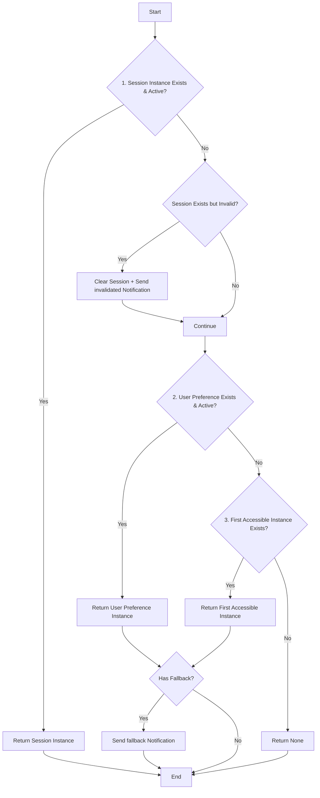

# HAInstanceHelper Refactoring

## Overview

To eliminate code duplication and unify instance selection logic, we created the `HAInstanceHelper` shared service class.

## Problem Description

Before refactoring, the following **three** locations had duplicate instance selection logic:

1. **`controllers/controllers.py:11-100`** - Controller version
   - ✅ Session validation
   - ✅ Bus notifications
   - ✅ Comprehensive logging
   - ✅ Ordered search
   - ❌ Missing user preference support

2. **`models/ha_entity_history.py:78-113`** - Model version
   - ✅ User preference support
   - ❌ Missing session validation
   - ❌ Missing bus notifications
   - ❌ Missing comprehensive logging
   - ❌ Missing ordered search

3. **`models/common/websocket_client.py:15-44`** - WebSocketClient version
   - ❌ Missing session validation
   - ❌ Missing user preference support
   - ❌ Missing bus notifications
   - ⚠️ Simple logging (DEBUG and WARNING only)
   - ✅ Ordered search

## Solution

Created `HAInstanceHelper` class, integrating all advantages from both versions:

### File Location

```
models/common/instance_helper.py
```

### Class Structure

```python
class HAInstanceHelper:
    @staticmethod
    def get_current_instance(env, logger=None):
        """
        ⚠️ Architecture Update (2025-11-25): Removed is_default field, using permission-aware 3-level fallback

        Unified instance retrieval logic

        Priority:
        1. current_ha_instance_id from Session (validated for validity)
        2. User preference (res.users.current_ha_instance_id)
        3. First accessible instance (via get_accessible_instances(), filtered by ir.rule)

        Features:
        - Session validation with automatic cleanup
        - User preference support across sessions
        - Permission-aware fallback (respects ir.rule)
        - Bus notifications for invalidation/fallback
        - Comprehensive logging (DEBUG/INFO/WARNING/ERROR)
        """
```

## Integrated Features

### 1. Session Validation (from Controller)

- Validates if instance in session exists and is active
- If invalid, clears session and sends `instance_invalidated` notification

### 2. User Preference Support (from Model)

- Supports `res.users.current_ha_instance_id` user preference setting
- Falls back to user preference when session is invalid

### 3. Bus Notifications (from Controller)

- `notify_instance_invalidated()` - When session instance is invalid
- `notify_instance_fallback()` - When falling back to another instance
- Supports three fallback types:
  - `user_preference` - Fallback to user preference
  - `default` - Fallback to default instance
  - `first_active` - Fallback to first active instance

### 4. Comprehensive Logging (from Controller)

- DEBUG: Normal instance selection
- INFO: Fallback situations
- WARNING: Instance invalid or not found
- ERROR: Notification send failures

### 5. Ordered Search (from Controller)

- First active instance uses `order='sequence, id'`
- Ensures consistent and predictable results

## Updated Files

### 1. New Files

- `models/common/instance_helper.py` - HAInstanceHelper class
- `models/common/__init__.py` - Added imports

### 2. Updated Files

#### `controllers/controllers.py`

**Before:**
```python
def _get_current_instance(self):
    # 90+ lines of implementation
    ...
```

**After:**
```python
from odoo.addons.odoo_ha_addon.models.common.instance_helper import HAInstanceHelper

def _get_current_instance(self):
    return HAInstanceHelper.get_current_instance(request.env, logger=self._logger)
```

#### `models/ha_entity_history.py`

**Before:**
```python
def _get_current_instance(self):
    # 35+ lines of implementation
    ...
```

**After:**
```python
from .common.instance_helper import HAInstanceHelper

def _get_current_instance(self):
    return HAInstanceHelper.get_current_instance(self.env, logger=self._logger)
```

#### `models/common/websocket_client.py`

**Before:**
```python
def __init__(self, env, instance_id=None):
    # 25+ lines of 2-level fallback implementation
    # Only: default instance → first active instance
    # Missing: session, user preference, notifications
    ...
```

**After:**
```python
def __init__(self, env, instance_id=None):
    self.env = env
    self._logger = logging.getLogger(__name__)

    if instance_id is None:
        from .instance_helper import HAInstanceHelper
        self.instance_id = HAInstanceHelper.get_current_instance(env, logger=self._logger)
    else:
        self.instance_id = instance_id
```

## 3-Level Fallback Mechanism



## Advantages

### 1. Code Maintainability

- **Single Source of Truth**: Instance selection logic maintained in one place only
- **DRY Principle**: Eliminated **150+ lines of duplicate code**
  - Controller: 90 lines → 1 line
  - Model: 35 lines → 1 line
  - WebSocketClient: 25 lines → 8 lines
- **Consistency**: Controller, Model, WebSocketClient use exactly same logic

### 2. Feature Completeness

- Integrated all advantages from three versions
- WebSocketClient upgraded from 2-level to 3-level fallback
- Supports more use cases (HTTP request, Cron, Shell)
- Better error handling and user feedback

### 3. Testability

- Static methods easy to unit test
- Can test in different contexts (with/without request)
- Logger can be mocked for testing

### 4. Extensibility

- Easy to add new fallback levels in future
- Can add additional validation logic
- Easy to add new notification types

## Usage Examples

### Use in Controller

```python
from odoo.addons.odoo_ha_addon.models.common.instance_helper import HAInstanceHelper

class MyController(http.Controller):
    _logger = logging.getLogger(__name__)

    def my_endpoint(self):
        instance_id = HAInstanceHelper.get_current_instance(
            request.env,
            logger=self._logger
        )
        if not instance_id:
            return {'error': 'No HA instance available'}
```

### Use in Model

```python
from .common.instance_helper import HAInstanceHelper

class MyModel(models.Model):
    _logger = logging.getLogger(__name__)

    def my_method(self):
        instance_id = HAInstanceHelper.get_current_instance(
            self.env,
            logger=self._logger
        )
        if not instance_id:
            raise ValidationError('No HA instance available')
```

### Use in Cron Job

```python
# Can also be used without HTTP request
def scheduled_task(self):
    instance_id = HAInstanceHelper.get_current_instance(self.env)
    # Will automatically skip session check, use user preference or default instance
```

## Test Recommendations

### Unit Test Scenarios

1. **Session Valid**: Should return session instance
2. **Session Invalid**: Should clear session, send notification, fallback to next level
3. **User Preference**: Should use when session is invalid
4. **First Accessible Instance**: Should use when first two are invalid
5. **No Instance**: Should return None and log warning
6. **Non-HTTP Context**: Should skip session check

### Integration Test Scenarios

1. Test if Controller endpoints work correctly
2. Test if Model methods work correctly
3. Test if Bus notifications are sent correctly
4. Test if Systray instance switching works correctly

## Version History

- **2025-11-04**: Initial version, refactoring completed
  - Created HAInstanceHelper class
  - Updated Controller and Model
  - Integrated all features
- **2025-11-25**: Architecture update
  - Removed `is_default` field
  - Changed to 3-level permission-aware fallback
  - Uses `sequence` + `get_accessible_instances()`

## Related Documentation

- [instance-switching.md](instance-switching.md) - Instance switching mechanism
- [../guides/bus-mechanisms.md](../guides/bus-mechanisms.md) - Bus notification mechanism
- `/CLAUDE.md` - Project architecture explanation

## Notes

1. **Backward Compatibility**: All original calling methods remain unchanged
2. **Log Level**: Ensure production environment doesn't generate excessive DEBUG logs
3. **Performance**: Static method call overhead is minimal
4. **Error Handling**: Bus notification failures don't affect main functionality

## Future Improvements

1. Add instance selection caching mechanism
2. Support instance selection hook mechanism
3. Add instance health check
4. Support instance weighting and load balancing
