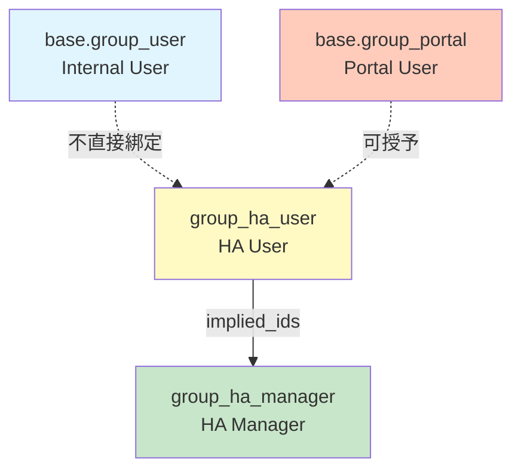

# Security Architecture - 安全架構圖解

> 本文檔圖解說明 `security/security.xml` 的權限控制架構

## ⚠️ 重要變更 (2025-11-17)

**最新權限架構**: 採用**兩層群組設計** + **分組級別權限**

- ✅ **專屬權限群組**: 創建 `group_ha_user` 遵循 Point of Sale 模組模式
- ✅ **最小權限原則**: 用戶需明確授權才能訪問 HA 功能（不再自動綁定到 `base.group_user`/`base.group_portal`）
- ✅ **符合正規化**: User → Entity Group → Entity (無冗餘關聯)
- ✅ **細粒度控制**: 用戶只能訪問授權的 entity groups 和其中的 entities
- ✅ **靈活的分組共享**: 同一實例內，不同用戶可以訪問不同的 groups
- ✅ **Portal 用戶支持**: Portal 用戶也可獲得 `group_ha_user` 訪問 HA 儀表板

## 整體架構圖

```
┌─────────────────────────────────────────────────────────┐
│                    權限系統架構（新）                     │
└─────────────────────────────────────────────────────────┘
                            │
        ┌───────────────────┴───────────────────┐
        │                                       │
        ▼                                       ▼
┌───────────────┐                     ┌───────────────┐
│ 權限組 (Group)│                     │ 記錄規則 (Rule)│
└───────────────┘                     └───────────────┘
        │                                       │
        ├─ group_ha_user (HA User)             ├─ 6 個模型 × 2 規則
        └─ group_ha_manager (Manager)          └─ = 12 條規則
```

## 權限組層級（兩層設計）



**⚠️ 重要**:
- `group_ha_user` **不包含** `implied_ids` → 不綁定任何 User Type
- Internal User 和 Portal User 都可以獲得 `group_ha_user`
- Manager 通過 `implied_ids` 自動包含 `base.group_user` + `group_ha_user`

**權限組定義** (`security.xml:12-24`):

1. **group_ha_user** (HA User)
   - 基礎 HA 訪問權限
   - **不包含** `implied_ids`（允許 Portal 用戶使用）
   - 可以查看授權的 HA 實體和數據
   - 需明確授權才能訪問 HA 功能

2. **group_ha_manager** (HA Manager)
   - 完整 HA 管理權限
   - `implied_ids`: `base.group_user` + `group_ha_user`
   - 可以管理 HA 實例、配置和高級設定
   - 分類: Administration (系統管理)

## 新權限架構：Entity Group 為核心

```
┌──────────────┐
│  res.users   │  普通用戶
└──────┬───────┘
       │ Many2many (user_ids / ha_entity_group_ids)
       │
       ▼
┌──────────────────┐
│ ha.entity.group  │  ← 權限控制的核心！
├──────────────────┤
│ - user_ids       │  授權用戶列表
│ - entity_ids     │  包含的 entities
│ - ha_instance_id │  所屬實例（只是分類）
└──────┬───────────┘
       │ Many2many (entity_ids)
       │
       ▼
┌──────────────┐
│  ha.entity   │  實體數據（只讀）
└──────────────┘
       │
       ▼
┌──────────────┐
│ ha.entity    │
│ .history     │  歷史數據
└──────────────┘
```

## 權限流程圖

```
使用者登入
    │
    ▼
┌───────────────────┐
│ 是否為 Manager?   │
├───────────────────┤
│ YES │      │ NO   │
│     │      │      │
│     ▼      ▼      │
│  全部   授權的     │
│ groups  groups    │
│   │       │       │
│   ▼       ▼       │
│ 全權限  只讀權限   │
└───────────────────┘
        │
        ▼
┌─────────────────────────────────┐
│ 通過 groups 訪問相關數據        │
├─────────────────────────────────┤
│ - Entities (group.entity_ids)   │
│ - Instances (group.ha_instance) │
│ - Areas (instance.area_ids)     │
│ - History (entity.history_ids)  │
└─────────────────────────────────┘
```

## 詳細權限規則

### 規則 1-2: HA Instance 實例 (`security.xml:33-57`)

```
┌─────────────────────────────────────────────────────────┐
│              ha_instance 訪問控制（新）                  │
└─────────────────────────────────────────────────────────┘

HA User (group_ha_user)                 Manager (group_ha_manager)
        │                                        │
        ▼                                        ▼
┌────────────────────┐                  ┌────────────────────┐
│ domain_force:      │                  │ domain_force:      │
│ id in user.        │                  │ [(1, '=', 1)]      │
│ ha_entity_group_   │                  │ (全部實例)         │
│ ids.mapped(        │                  └────────────────────┘
│ 'ha_instance_id'   │                           │
│ ).ids              │                           ▼
└────────────────────┘                  ┌────────────────┐
        │                                │ 讀取: ✓        │
        ▼                                │ 寫入: ✓        │
┌────────────────────┐                  │ 創建: ✓        │
│ 讀取: ✓            │                  │ 刪除: ✓        │
│ 寫入: ✗            │                  └────────────────┘
│ 創建: ✗            │
│ 刪除: ✗            │
└────────────────────┘
```

**規則 1 - 普通用戶訪問** (`ha_instance_user_rule`):
- 只能**讀取**通過 entity groups 間接訪問的實例
- Domain: `('id', 'in', user.ha_entity_group_ids.mapped('ha_instance_id').ids)`
- **不能**寫入、創建或刪除

**規則 2 - Manager 全權限** (`ha_instance_manager_rule`):
- 可以讀取、寫入、創建、刪除所有實例
- Domain: `[(1, '=', 1)]` 永遠為 True

### 規則 3-4: HA Entity 實體 (`security.xml:68-92`)

```
所有實體 (ha_entity)
⚠️ 特殊規則：實體數據從 Home Assistant 同步而來
   CUD 操作由 WebSocket 服務執行（admin user UID=1）

┌──────────────────────────────────────────────────────┐
│    訪問控制：通過 Entity Groups                       │
└──────────────────────────────────────────────────────┘

普通用戶規則                    Manager規則
    │                              │
    ▼                              ▼
domain_force:                 domain_force:
id in user.                  [(1, '=', 1)]
ha_entity_group_ids.
mapped('entity_ids').ids
    │                                 │
    ▼                                 ▼
權限: 只讀                        權限: 只讀 ⚠️
(Read Only)                      (Read Only)
- 只能讀取授權 groups             - 可以讀取所有實體
  中的 entities                   - 不可手動修改

                 WebSocket 服務
                (Admin User UID=1)
                       │
                       ▼
            自動同步 HA 實體數據 (CRUD)
            - 繞過所有 access rules
            - 無需 group 權限
```

**規則 3 - 普通用戶訪問** (`ha_entity_user_rule`):
- 只能讀取授權 entity groups 中的實體
- Domain: `('id', 'in', user.ha_entity_group_ids.mapped('entity_ids').ids)`
- **不可執行** CUD 操作

**規則 4 - Manager 只讀訪問** (`ha_entity_manager_rule`):
- 可以查看所有實體
- **只能讀取，不可修改**（數據由 WebSocket 服務同步）
- perm_read=True, perm_write/create/unlink=False

**WebSocket 服務訪問** (程式碼層級):
- 使用 admin user (UID=1) 創建環境: `api.Environment(cr, 1, {})`
- Admin user 自動繞過所有 `ir.model.access` 和 `ir.rule` 檢查
- 無需任何 group 權限即可執行 CRUD 操作
- 自動同步 Home Assistant 數據

### 規則 5-6: HA Entity History 歷史數據 (`security.xml:100-120`)

```
entity_id → 來自 user.ha_entity_group_ids.mapped('entity_ids')
    └─ 通過 entity groups 控制
```

**規則 5 - 普通用戶訪問** (`ha_entity_history_user_rule`):
- Domain: `('entity_id', 'in', user.ha_entity_group_ids.mapped('entity_ids').ids)`
- 只能查看授權 entities 的歷史數據

**規則 6 - Manager 全權限** (`ha_entity_history_manager_rule`)

### 規則 7-8: HA Area 區域 (`security.xml:128-148`)

**規則 7 - 普通用戶訪問** (`ha_area_user_rule`):
- Domain: `('ha_instance_id', 'in', user.ha_entity_group_ids.mapped('ha_instance_id').ids)`
- 可以查看授權 groups 所屬實例的所有區域

**規則 8 - Manager 全權限** (`ha_area_manager_rule`)

### 規則 9-10: HA Entity Group 分組 (`security.xml:156-174`)

**核心權限控制點！**

```
┌──────────────────────────────────────┐
│     ha.entity.group 訪問控制         │
└──────────────────────────────────────┘

普通用戶                Manager
    │                      │
    ▼                      ▼
user_ids = False      [(1, '=', 1)]
    OR                (全部 groups)
user_ids in [me]
    │                      │
    ▼                      ▼
公開 groups +          全權限 (CRUD)
授權 groups
(可以 CRUD)
```

**規則 9 - Entity Group** (`ha_entity_group_user_rule`):
- 普通用戶可以**創建和管理**分組
- 只能看到：
  - `user_ids = False` (公開的 group)
  - `user_ids in [user.id]` (授權給自己的 group)

**規則 10 - Manager** (`ha_entity_group_manager_rule`):
- 可以看到和管理所有 groups

### 規則 11-12: Group Tag 標籤 (`security.xml:176-192`)

**規則 11 - 普通用戶** (`ha_entity_group_tag_user_rule`):
- Domain: `('id', 'in', user.ha_entity_group_ids.mapped('tag_ids').ids)`
- 只能看到授權 groups 的標籤

**規則 12 - Manager** (`ha_entity_group_tag_manager_rule`):
- 可以看到所有標籤

## 權限矩陣總覽

| 模型 | 代碼行數 | 普通用戶 | Manager |
|------|---------|---------|---------|
| **ha.instance** | 26-50 | 讀取 (via groups) | 全權限 (CRUD) |
| **ha.entity** ⚠️ | 61-85 | 讀取 (via groups) | **只讀** |
| **ha.entity.history** | 93-113 | 讀取 (via groups) | 全權限 |
| **ha.area** | 121-141 | 讀取 (via groups) | 全權限 |
| **ha.entity.group** 🔑 | 149-167 | 讀取+管理 (授權的) | 全權限 |
| **ha.entity.group.tag** | 169-185 | 讀取 (via groups) | 全權限 |

**⚠️ 特殊說明**: `ha.entity` 數據由 WebSocket 服務從 Home Assistant 自動同步（使用 admin user UID=1），禁止所有用戶手動修改以保持數據一致性。

**🔑 核心權限點**: `ha.entity.group` 是整個權限系統的核心控制點！

## 實際運作案例

### 案例 1: 普通用戶 John

```
1. John 登入系統 (Internal User + group_ha_user)
2. 系統檢查 John 的 ha_entity_group_ids:
   → 授權的 groups: "客廳設備", "廚房設備"
3. 查看實體列表
   → 只看到這兩個 groups 中的 entities
   → 看不到 "臥室設備" group 的 entities
4. 查看實例列表
   → 只看到這些 groups 所屬的實例 (只讀)
5. 嘗試創建新實例
   → ❌ 拒絕 (perm_create = False)
6. 創建新的 entity group "書房設備"
   → ✅ 允許，並自動成為該 group 的授權用戶
```

### 案例 2: Manager Alice

```
1. Alice 登入系統 (擁有 group_ha_manager)
2. 查看所有數據
   → ✅ 看到所有實例、groups、entities
3. 管理實例和 groups
   → ✅ 創建、修改、刪除都允許
4. 嘗試手動修改 entity 數據
   → ❌ 拒絕 (perm_write = False，數據由 WebSocket 同步)
5. 授權用戶訪問 groups
   → ✅ 可以修改 group.user_ids 來授權用戶
```

### 案例 3: 公開 Group

```
1. Manager 創建 "公共區域" group
2. 設置 user_ids = [] (留空，表示公開)
3. 所有用戶都可以看到這個 group 和其中的 entities
4. 普通用戶可以將 entities 加入這個 group
```

## 關鍵設計要點

### 🔑 核心概念

1. **Entity Group 為權限核心**
   ```
   User → Entity Group → Entity
   ```
   - 用戶通過 groups 授權訪問 entities
   - Instance 只是分類，不直接控制權限

2. **符合資料庫正規化**
   ```
   ✅ User ↔ Entity Group (Many2many)
   ✅ Entity Group → Instance (Many2one，分類用)
   ✅ Entity Group ↔ Entity (Many2many)
   ❌ 沒有 User → Instance → Entity 的冗餘路徑
   ```

3. **公開 vs 私有 Groups**
   ```python
   # 公開 group: user_ids = False/[]
   group.user_ids = False  # 所有用戶可見

   # 私有 group: user_ids = [user1, user2]
   group.user_ids = [(4, user1.id), (4, user2.id)]  # 只有授權用戶可見
   ```

4. **Domain Force 語法**
   ```python
   # 普通用戶規則 - 通過 groups 訪問 entities
   [
       ('id', 'in', user.ha_entity_group_ids.mapped('entity_ids').ids)
   ]

   # Entity Group 規則 - 公開 OR 授權
   [
       '|',  # OR 操作符
       ('user_ids', '=', False),       # 條件1: 公開 group
       ('user_ids', 'in', [user.id])   # 條件2: 授權給我
   ]
   ```

5. **Mapped 路徑訪問**
   ```python
   # 訪問實例
   user.ha_entity_group_ids.mapped('ha_instance_id').ids

   # 訪問 entities
   user.ha_entity_group_ids.mapped('entity_ids').ids

   # 訪問標籤
   user.ha_entity_group_ids.mapped('tag_ids').ids
   ```

### ✅ 安全保證

這個安全架構確保了：

- ✅ **細粒度控制**: 用戶只看到授權的 entity groups 和其中的數據
- ✅ **符合正規化**: User → Group → Entity，沒有冗餘關聯
- ✅ **靈活授權**:
  - 公開 groups (所有用戶可見)
  - 私有 groups (只有授權用戶可見)
- ✅ **數據一致性**:
  - Groups 的 entities 必須屬於同一實例
  - **ha.entity 數據只能由 WebSocket 服務修改**（admin user），防止手動破壞數據一致性
- ✅ **最小權限原則**: 普通用戶默認只能讀取授權的數據
- ✅ **同步數據保護**: WebSocket 服務以 admin user (UID=1) 運行，自動繞過 access rules，確保數據完整性

### ⚠️ 注意事項

1. **Group 管理權限**:
   - 普通用戶可以創建和管理 entity groups
   - 但只能看到和使用授權給自己的 groups

2. **性能考慮**:
   - `mapped()` 操作在大量數據時可能影響性能
   - 建議在 `ha_entity_group_user_rel` 添加索引

3. **數據遷移**:
   - 從舊架構（Instance-based）升級到新架構需要數據遷移
   - 詳見 `docs/migration/instance-to-group-based-permissions.md`

## 相關文件

- **實現文件**: `security/security.xml`
- **訪問權限文件**: `security/ir.model.access.csv`
- **數據遷移指南**: `docs/migration/instance-to-group-based-permissions.md`
- **多實例架構**: `docs/tasks/multi-ha-implementation.md`

## 修改指南

### 添加新模型權限

當添加新的模型時，需要考慮：

**如果需要通過 groups 控制**:

```xml
<!-- 普通用戶規則 -->
<record id="your_model_user_rule" model="ir.rule">
    <field name="name">Your Model: User Access (via Groups)</field>
    <field name="model_id" ref="model_your_model"/>
    <field name="domain_force">[
        ('related_field_id', 'in', user.ha_entity_group_ids.mapped('some_field').ids)
    ]</field>
    <field name="groups" eval="[(4, ref('group_ha_user')))]"/>
    <field name="perm_read" eval="True"/>
    <field name="perm_write" eval="False"/>
    <field name="perm_create" eval="False"/>
    <field name="perm_unlink" eval="False"/>
</record>

<!-- Manager 規則 -->
<record id="your_model_manager_rule" model="ir.rule">
    <field name="name">Your Model: Manager Full Access</field>
    <field name="model_id" ref="model_your_model"/>
    <field name="domain_force">[(1, '=', 1)]</field>
    <field name="groups" eval="[(4, ref('group_ha_manager'))]"/>
</record>
```

## 測試建議

```python
# 測試普通用戶權限
def test_user_group_based_access():
    # 1. 創建測試用戶和 group
    user = self.env['res.users'].create({...})
    group = self.env['ha.entity.group'].create({
        'name': '測試分組',
        'user_ids': [(4, user.id)]
    })

    # 2. 添加 entities 到 group
    group.entity_ids = [(4, entity1.id), (4, entity2.id)]

    # 3. 切換到測試用戶，驗證只能看到授權的 entities
    entities = self.env['ha.entity'].with_user(user).search([])
    assert set(entities.ids) == {entity1.id, entity2.id}

# 測試公開 group
def test_public_group_access():
    # 創建公開 group (user_ids = False)
    group = self.env['ha.entity.group'].create({
        'name': '公開分組',
        'user_ids': False
    })

    # 所有用戶應該可以看到
    entities = self.env['ha.entity'].with_user(user).search([
        ('id', 'in', group.entity_ids.ids)
    ])
    assert len(entities) > 0
```

---

**最後更新**: 2025-11-17 (兩層權限組設計 + Group-based 權限架構)
**適用版本**: Odoo 18
**相關模組**: odoo_ha_addon

## 變更歷史

### 2025-11-17 (重大變更 - 兩層權限組設計)
- 🔄 **權限組重構**: 創建專屬 `group_ha_user` 遵循 Point of Sale 模組模式
- ✅ **最小權限原則**: 不再自動綁定 `base.group_user`/`base.group_portal`
- ✅ **Portal 用戶支持**: `group_ha_user` 不包含 `implied_ids`，允許 Portal 用戶使用
- ✅ **兩層設計**: `group_ha_user` (基礎訪問) → `group_ha_manager` (完整管理)
- ✅ **更新 12 條權限規則**: 全部改為綁定 `group_ha_user` 而非 `base.group_user`
- ✅ **簡化訪問控制**: `ir.model.access.csv` 從 19 行精簡至 12 行

### 2025-11-16 (重大變更 - Group-based 權限)
- 🔄 **重構權限架構**: 從 Instance-based 改為 Group-based
- ✅ **新增 user_ids 欄位**: ha.entity.group 支持細粒度授權
- ✅ **重寫 12 條權限規則**: 全部基於 entity groups 控制
- ✅ **符合正規化**: 移除 User → Instance 的冗餘關聯
- ✅ **支持公開/私有 groups**: user_ids=False 表示公開

### 2025-11-16 (早期)
- ✅ **移除 `access_ha_entity_system`**: WebSocket 服務使用 admin user (UID=1)，無需 group 權限
- ✅ 更新文檔：將所有 System Admin 相關描述改為 admin user 或 WebSocket 服務

### 2025-11-13
- ✅ P0 Critical Issues 修復
- ✅ 創建 `Home Assistant Manager` 權限組
- ✅ 實現 10 條記錄規則（ir.rule）
- ✅ **ha.entity 改為只讀**：所有用戶（包括 Manager）只能讀取，WebSocket 服務可完整操作
