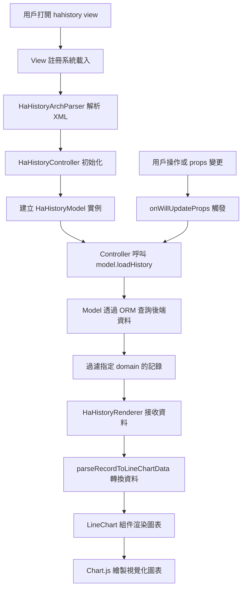

# HAHistory 自定義 View 技術分析

## 概述

本文檔深度分析 Odoo HA Addon 中 hahistory 自定義 view 的技術架構與運作原理。HAHistory View 是一個專為 Home Assistant 歷史資料視覺化設計的自定義 Odoo 18 視圖組件。

## 系統架構

### 檔案結構

```
odoo_ha_addon/
├── static/src/
│   ├── hahistory_view.js              # 主要 view 註冊檔案
│   ├── hahistory_controller.js        # Controller 層
│   ├── hahistory_controller.xml       # Controller 模板
│   ├── hahistory_arch_parser.js       # XML 架構解析器
│   ├── HaHistoryRenderer/
│   │   ├── hahistory_model.js         # Model 層
│   │   ├── hahistory_renderer.js      # Renderer 層
│   │   └── hahistory_renderer.xml     # Renderer 模板
│   ├── line_chart/
│   │   └── line_chart.js              # Chart.js 整合組件
│   └── chart/
│       └── ha_chart.js                # 基礎圖表組件
├── models/
│   └── ha_entity_history.py           # 後端資料模型
└── views/
    └── ha_entity_history_views.xml    # View 定義
```

### MVC 架構

HAHistory View 採用標準的 Odoo 18 OWL 框架 MVC 模式：

- **Model**: 負責資料管理和業務邏輯
- **View**: 負責用戶界面展示
- **Controller**: 負責協調 Model 和 View 的互動

## 技術實現詳解

### 1. View 註冊機制

```javascript
// hahistory_view.js
export const haHistoryView = {
  type: "hahistory",
  display_name: "HaHistory",
  icon: "fa fa-line-chart",
  multiRecord: true,
  Controller: HaHistoryController,
  ArchParser: HaHistoryArchParser,
  Model: HaHistoryModel,
  Renderer: HaHistoryRenderer,

  props(genericProps, view) {
    const { ArchParser } = view;
    const { arch } = genericProps;
    const archInfo = new ArchParser().parse(arch);

    return {
      ...genericProps,
      Model: view.Model,
      Renderer: view.Renderer,
      archInfo,
    };
  },
};

registry.category("views").add("hahistory", haHistoryView);
```

**關鍵特點：**
- 向 Odoo 的 view registry 註冊自定義 view 類型
- 定義 MVC 各層的類別映射
- 透過 props 方法處理 view 屬性

### 2. 架構解析器 (ArchParser)

```javascript
// hahistory_arch_parser.js
export class HaHistoryArchParser {
  parse(xmlDoc) {
    const domains = (xmlDoc.getAttribute("domain") || "").split(",");
    const limit = xmlDoc.getAttribute("limit") || 80;
    return {
      domains,
      limit,
    };
  }
}
```

**功能：**
- 解析 XML 定義中的屬性
- 提取過濾條件和記錄限制

### 3. Model 層設計

```javascript
// hahistory_model.js
export class HaHistoryModel {
  constructor(orm, resModel, archInfo) {
    this.orm = orm;
    this.resModel = resModel;
    this.domains = archInfo.domains;
    this.limit = archInfo.limit;
    this.keepLast = new KeepLast();
    this.records = [];
  }

  async loadHistory(domain) {
    const taskFun = async () => {
      const result = await this.orm.webSearchRead(this.resModel, domain, {
        limit: this.limit,
        specification: {
          entity_id: {},
          state: {},
          num_state: {},
          domain: {},
          last_updated: {},
          last_changed: {},
        },
      });

      const filteredRecords = result.records.filter((record) =>
        this.domains.some((elt) => elt === record["domain"])
      );

      this.records = filteredRecords;
    };

    return this.keepLast.add(taskFun());
  }
}
```

**關鍵技術：**
- 使用 Odoo ORM 進行資料查詢
- KeepLast 機制防止競態條件
- 根據 domain 過濾記錄

### 4. Controller 層邏輯

```javascript
// hahistory_controller.js
export class HaHistoryController extends Component {
  static template = "odoo_ha_addon.HaHistoryController";

  setup() {
    this.orm = useService("orm");
    this.model = useState(
      new this.props.Model(this.orm, this.props.resModel, this.props.archInfo)
    );

    onWillStart(async () => {
      await this.model.loadHistory(this.props.domain);
    });

    onWillUpdateProps(async (nextProps) => {
      if (JSON.stringify(nextProps.domain) !== JSON.stringify(this.props.domain)) {
        await this.model.loadHistory(nextProps.domain);
      }
    });
  }
}
```

**特點：**
- 使用 OWL 的響應式狀態管理
- 生命週期鉤子處理資料載入
- Props 變更時自動重新載入資料

### 5. Renderer 層實現

```javascript
// hahistory_renderer.js
export class HaHistoryRenderer extends Component {
  static template = "odoo_ha_addon.HaHistoryRenderer";
  static components = { HAChart, LineChart };

  setup() {
    this.state = useState({
      lineChart: { data: {} },
    });

    onWillStart(async () => {
      this.renderRecords(this.props.model.records);
    });

    onWillUpdateProps(async (nextProps) => {
      this.renderRecords(nextProps.model.records);
    });
  }

  renderRecords(records) {
    const lineChartData = parseRecordToLineChartData(records);
    this.state.lineChart.data = lineChartData;
  }
}
```

**功能：**
- 將原始記錄轉換為圖表資料
- 管理圖表組件的狀態
- 響應資料變更並重新渲染

## 資料流向與處理

### 資料轉換管道

```javascript
function parseRecordToLineChartData(records) {
  // 1. 時間排序
  records.sort((a, b) =>
    new Date(a.last_changed).getTime() < new Date(b.last_changed).getTime() ? -1 : 1
  );

  // 2. 生成時間標籤
  const chartLebels = records.map((record) => parseLabel(record.last_changed));

  // 3. 按 entity_id 分組
  const rawDatasets = records.reduce((acc, record) => {
    const entity_id = record.entity_id;
    if (acc[entity_id]) {
      acc[entity_id].push(record);
    } else {
      acc[entity_id] = [record];
    }
    return acc;
  }, {});

  // 4. 轉換為 Chart.js 格式
  const chartDatasets = Object.entries(rawDatasets).map(([entity_id, records]) => {
    const values = records.map((record) => record.num_state);
    return {
      label: entity_id,
      data: values,
      spanGaps: true,
    };
  });

  return {
    type: "line",
    options: { responsive: true },
    data: {
      labels: chartLebels,
      datasets: chartDatasets,
    },
  };
}
```

## 系統運作流程



## 與 Odoo 18 框架整合

### 資產載入順序

```python
# __manifest__.py
'assets': {
    'web.assets_backend': [
        # 基礎組件
        'odoo_ha_addon/static/src/chart/ha_chart.js',
        'odoo_ha_addon/static/src/line_chart/line_chart.js',

        # HaHistory 組件
        'odoo_ha_addon/static/src/HaHistoryRenderer/hahistory_model.js',
        'odoo_ha_addon/static/src/HaHistoryRenderer/hahistory_renderer.js',
        'odoo_ha_addon/static/src/hahistory_arch_parser.js',
        'odoo_ha_addon/static/src/hahistory_controller.js',

        # View 註冊
        'odoo_ha_addon/static/src/hahistory_view.js',
    ],
}
```

### 後端資料模型

```python
# ha_entity_history.py
class HAEntityHistory(models.Model):
    _name = 'ha.entity.history'
    _description = 'Home Assistant Entity History'

    domain = fields.Char(string='Domain', required=True)
    state = fields.Char(string='State')
    last_changed = fields.Datetime(string='Last Changed')
    last_updated = fields.Datetime(string='Last Updated')
    attributes = fields.Json(string='Attributes')
    num_state = fields.Float(string='Numeric State', compute='_compute_num_state', store=True)
    entity_id = fields.Many2one('ha.entity', string='Entity', required=True, ondelete='cascade')

    @api.depends('state')
    def _compute_num_state(self):
        for record in self:
            try:
                record.num_state = float(record.state)
            except (ValueError, TypeError):
                record.num_state = -1
```

## 關鍵技術特點

### 1. 並行控制
- 使用 `KeepLast` 類別防止競態條件
- 確保只有最後一個請求結果被採用

### 2. 響應式狀態管理
- 透過 OWL `useState` 實現自動重新渲染
- 資料變更時組件自動更新

### 3. 動態資源載入
- Chart.js 透過 `loadJS` 動態載入
- 避免影響初始頁面載入效能

### 4. 模組化設計
- 每個組件職責明確分離
- 可重用的組件架構

### 5. 資料轉換管道
- 完整的資料格式轉換流程
- 從 Odoo 記錄到 Chart.js 的無縫轉換

## 使用範例

### XML View 定義

```xml
<record id="ha_entity_history_view_hahistory" model="ir.ui.view">
  <field name="name">ha.entity.history.hahistory</field>
  <field name="model">ha.entity.history</field>
  <field name="arch" type="xml">
    <hahistory domain="input_number">
    </hahistory>
  </field>
</record>
```

### Action 配置

```xml
<record id="entity_history_action" model="ir.actions.act_window">
  <field name="name">HA Entity History</field>
  <field name="res_model">ha.entity.history</field>
  <field name="view_mode">hahistory,list,form</field>
</record>
```

## Dashboard 狀態保存機制

### 問題背景

當用戶將 HAHistory View 加入 Dashboard 時，希望能保存當前的顯示模式（合併/分開），下次從 Dashboard 打開時能恢復該設定。

### 解決方案：useSetupAction Hook

Odoo 提供 `useSetupAction` hook 來整合 action 系統，實現狀態的保存與恢復。

#### 關鍵機制比較

| 機制 | 用途 | 持久化 | 適用場景 |
|------|------|--------|----------|
| `useSetupAction({ getContext })` | Dashboard 保存 | ✅ 存到資料庫 | Add to Dashboard |
| `useSetupAction({ getLocalState })` | Session 內導航 | ❌ 只在記憶體 | 返回上一頁 |
| Class method `getLocalState()` | **無效** | ❌ | 框架不會呼叫 |

### 實作方式

#### 1. Controller 設定

```javascript
// hahistory_controller.js
import { useSetupAction } from "@web/search/action_hook";

export class HaHistoryController extends Component {
  setup() {
    // 從 context 讀取初始值（Dashboard 恢復時會傳入）
    this.state = useState({
      displayMode: this.props.context?.hahistory_displayMode || "combined",
    });

    // 整合 Odoo action 系統，讓 Dashboard 能保存狀態
    useSetupAction({
      getContext: () => ({
        hahistory_displayMode: this.state.displayMode,
      }),
    });
  }

  setDisplayMode(mode) {
    this.state.displayMode = mode;
  }
}
```

#### 2. Controller Template

```xml
<!-- hahistory_controller.xml -->
<t t-component="props.Renderer"
   model="model"
   displayMode="state.displayMode"
   setDisplayMode.bind="setDisplayMode"/>
```

#### 3. Renderer 接收 Props

```javascript
// hahistory_renderer.js
export class HaHistoryRenderer extends Component {
  static props = {
    model: HaHistoryModel,
    displayMode: { type: String, optional: true },
    setDisplayMode: { type: Function, optional: true },
  };

  toggleDisplayMode() {
    const newMode = this.props.displayMode === "combined" ? "separate" : "combined";
    this.props.setDisplayMode?.(newMode);
    // 注意：直接傳遞 newMode，因為 props 更新是非同步的
    this.renderRecords(this.props.model.records, newMode);
  }

  renderRecords(records, displayModeOverride = null) {
    const displayMode = displayModeOverride || this.props.displayMode || "combined";
    // ... 根據 displayMode 渲染對應的圖表
  }
}
```

### 資料流向

```
┌─────────────────────────────────────────────────────────┐
│ Add to Dashboard 時                                      │
├─────────────────────────────────────────────────────────┤
│ 1. Odoo 呼叫 __getContext__ callbacks                    │
│ 2. useSetupAction 註冊的 getContext() 被呼叫             │
│ 3. 返回 { hahistory_displayMode: "separate" }           │
│ 4. Dashboard 保存到 ir.ui.view.custom                    │
└─────────────────────────────────────────────────────────┘
                          ↓
┌─────────────────────────────────────────────────────────┐
│ 從 Dashboard 打開時                                      │
├─────────────────────────────────────────────────────────┤
│ 1. Action 的 context 包含 { hahistory_displayMode: ... } │
│ 2. Controller 讀取 props.context.hahistory_displayMode   │
│ 3. 初始化 state.displayMode = "separate"                 │
│ 4. 傳遞給 Renderer 以正確模式渲染                         │
└─────────────────────────────────────────────────────────┘
```

### 注意事項

#### Props 更新時序問題

當 Renderer 切換 displayMode 時，需注意 props 更新是非同步的：

```javascript
// ❌ 錯誤：props.displayMode 還是舊值
toggleDisplayMode() {
  const newMode = this.props.displayMode === "combined" ? "separate" : "combined";
  this.props.setDisplayMode?.(newMode);
  this.renderRecords(this.props.model.records);  // 讀到舊的 displayMode
}

// ✅ 正確：直接傳遞新值
toggleDisplayMode() {
  const newMode = this.props.displayMode === "combined" ? "separate" : "combined";
  this.props.setDisplayMode?.(newMode);
  this.renderRecords(this.props.model.records, newMode);  // 傳遞新值
}
```

#### Context Key 命名

建議使用 view 名稱作為前綴，避免與其他 view 衝突：

```javascript
// 推薦格式：{viewType}_{propertyName}
hahistory_displayMode: "separate"
```

### 參考：Odoo 內建 View 實作

GraphController 使用相同機制保存圖表設定：

```javascript
// @web/views/graph/graph_controller.js
useSetupAction({
  getLocalState: () => {
    return { metaData: this.model.metaData };
  },
  getContext: () => this.getContext(),
});

getContext() {
  const { measure, groupBy, mode } = this.model.metaData;
  return {
    graph_measure: measure,
    graph_mode: mode,
    graph_groupbys: groupBy.map((gb) => gb.spec),
  };
}
```

## 總結

HAHistory 自定義 View 展現了現代 Odoo 18 開發的最佳實踐：

- **完整的 MVC 架構分離**
- **響應式狀態管理**
- **模組化組件設計**
- **高效的資料處理管道**
- **與第三方函式庫的無縫整合**
- **Dashboard 狀態保存整合**

這個實現為 Home Assistant 歷史資料在 Odoo 中的視覺化提供了強大而靈活的解決方案。