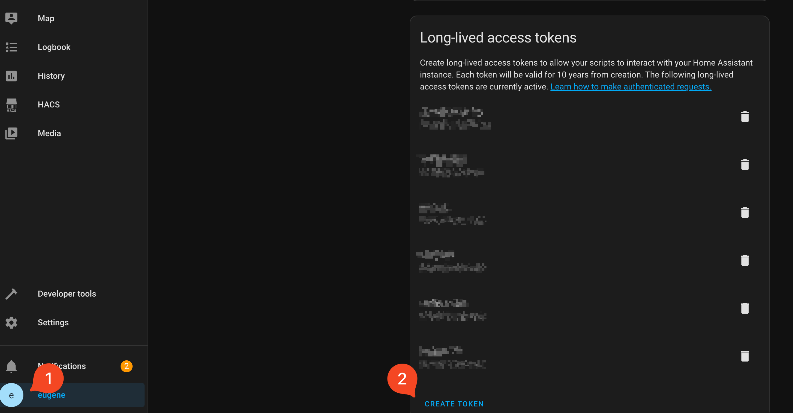

# HA 串接文件

開案人員: eugene chen
開案時間: January 29, 2024 9:58 PM
: Elmo Lin,eugene chen
專案交案日: 2023/09/30
專案類型: 資訊
是否完成: 進行中
最後修改時間: October 27, 2025 11:35 AM
對應專案: WOOW 雲端伺服器建置
最後修改人: eugene chen

# 目錄

# 預先準備

1. 取回 long-lived access tokens



1. 連線資訊
   - rest api: `http://localhost:8123/api/`
     - headers:
       ```
       "Authorization": Bearer {accessToken}
       "content-type": "application/json"
       ```
   - websocket: `ws://localhost:8123/api/websocket`
     - 依照 [Server states](https://developers.home-assistant.io/docs/api/websocket/#server-states) 為例串接

# 基本串接

一般來說，可以透過 rest api 或是 websocket 串接，且它們不是完全可互換的。因為要收即時狀態，所以 websocket 的引入是不可少的，所以會建議以 websocket 為主。

websocket 的 message 格式內容建議透過 HA UI 實際操作取得，官方是沒有文件的。雖然沒有正式的文件，但開發者可能會寫 services ( _call service_ ) 文件，可以透過 **_Developer Tools_** 中的選單進入，選好 service 後會出現使用說明。


## 取回 HA 裝置清狀態清單

「取回 HA 裝置」 列表的 api 有兩種方式都可以：

1. rest api: GET /api/states 見：[https://developers.home-assistant.io/docs/api/rest](https://developers.home-assistant.io/docs/api/rest)
2. websocket：送出以下 message

   ```json
   {
     "type": "get_states"
   }
   ```

## 操作 "智慧裝置"

### call service 操作 "智慧裝置"

控制智慧裝置一般是直接透過 _call service_ 操作的。

1. rest api ：`POST /api/services/<domain>/<service>`
2. websocket：送出以下 _call_service_ message 見：[https://developers.home-assistant.io/docs/api/websocket#calling-a-service](https://developers.home-assistant.io/docs/api/websocket#calling-a-service)

   ```json
   {
     "type": "call_service",
     "domain": "light",
     "service": "turn_on",
     ...
   }
   ```

其它例子如下：

### 例子：手動 “觸發執行 automation”

```json
{
  "type": "call_service",
  "domain": "automation",
  "service": "trigger",
  "service_data": {
    "entity_id": "automation.test_1",
    "skip_condition": true
  }
}
```

### 例子：手動 “觸發執行 script”

```json
{
  "type": "call_service",
  "domain": "script",
  "service": "confirmable_notification_1",
  "service_data": {}
}
```

## 訂閱裝置狀態改變事件

細節參考：[https://developers.home-assistant.io/docs/api/websocket/#subscribe-to-events](https://developers.home-assistant.io/docs/api/websocket/#subscribe-to-events)

websocket 送出下面 message 即開始訂閱

```json
{
  "id": 18
  "type": "subscribe_events",
  "event_type": "state_changed"
}
```

若有任何狀態改變，會收到以下訊息

```json
{
   "id": 18,
   "type":"event",
   "event":{
      "data":{
         "entity_id":"light.bed_light",
         "new_state":{
            ...
         },
         "old_state":{
            ...
         }
      },
      "event_type":"state_changed",
      "time_fired":"2016-11-26T01:37:24.265429+00:00",
      ...
   }
}
```

## Entity 組態資訊

### 取得 entity 組態清單

websocket：送出 `config/entity_registry/list` message。如下

```json
{
  "type": "config/entity_registry/list"
}
```

會回傳 **entity_registry** component 有註冊的所有 entities 清單。回傳的元素

```json
{
  "area_id": "ke_ting",
  "categories": {},
  "config_entry_id": null,
  "device_id": null,
  "disabled_by": null,
  "entity_category": null,
  "entity_id": "script.hihi",
  "has_entity_name": false,
  "hidden_by": null,
  "icon": null,
  "id": "8acb0e3a273bfbad55be7eb39bf5d162",
  "labels": [],
  "name": null,
  "options": {
    "conversation": {
      "should_expose": false
    }
  },
  "original_name": "hihi",
  "platform": "script",
  "translation_key": null,
  "unique_id": "hihi"
}
```

可依需求過濾 platform，如： `platform == automation`：

```jsx
const payload = await sendMessage({
  type: "config/entity_registry/list",
});
console.log(payload.result.filter((elt) => elt.platform === "automation"));
```

### 更新 entity 組態資訊

websocket：送出 `config/entity_registry/update` message，`entity_id` 為目標 entity。

**<更改 entity ”名稱”>**

```json
{
  "type": "config/entity_registry/update",
  "entity_id": "automation.test_1",
  "name": "test3-changed-name",
  "icon": null,
  "area_id": null,
  "new_entity_id": "automation.test_1"
}
```

name/icon/area_id/new_entity_id 都是可選的。

**<更改 entity 別名 ”aliases”>**

```json
{
  "type": "config/entity_registry/update",
  "entity_id": "switch.my_input_2",
  "aliases": ["my2", "test", "test4", "test5", "test6"]
}
```

**<更改 entity 區域 ”**area**”>**

```json
{
  "type": "config/entity_registry/update",
  "entity_id": "automation.test2",
  "name": null,
  "icon": null,
  "area_id": "living_room",
  "new_entity_id": "automation.test2"
}
```

### 取得 entity 組態資訊

websocket：送出 `config/entity_registry/get` message，`entity_id` 為目標 entity。如下

```json
{
  "type": "config/entity_registry/get",
  "entity_id": "automation.test_1"
}
```

## **Home Assistant URL**

取得 homeassistant 的 url：設定 Home Assistant 需要存取資料時（例如：播放文字語音或其他媒體）、與 Home Assistant 與其他裝置共享之網址。

Send

```json
{
  "type": "network/url",
  "id": 46
}
```

Received

```json
{
  "2": {
    "id": 46,
    "type": "result",
    "success": true,
    "result": {
      "internal": "http://192.168.0.243:8123",
      "external": null,
      "cloud": null
    }
  }
}
```

# HA 自動化串接

使用者操作文件可參考 [Automating Home Assistant - Home Assistant](https://www.home-assistant.io/docs/automation/)

## 🤖  自動化(Automation)

概念上，一個 Automation 是由一個描述資料構成，以 JSON 為例：

```json
{
  "description": "",
  "mode": "single",
  "trigger": [...],
  "condition": [...],
  "action": [...],
  "alias": "我的自動化"
}
```

下面的 `id` 全是指時間戳記 (單位是 **ms**)。

### 新增/編輯(更新)自動化 POST [/config/automation/config/{id}](http://localhost:8123/api/config/automation/config/%7Bid%7D)

新增/編輯都要用到整個 ”描述資料” ，都是同一個 POST [http://localhost:8123/api/config/automation/config/{id}](http://localhost:8123/api/config/automation/config/%7Bid%7D)

若是新增自動化， `id` 是指：**當前的 ms 時間戳記做為 id**。

json body:

```json
{
  "description": "",
  "mode": "single",
  "trigger": [],
  "condition": [],
  "action": [],
  "alias": "我的自動化"
}
```

若是編輯自動化， `id` 是目標 id，且 json body 要放上 `id` 資料。

### 取得自動化 GET [/config/automation/config/{id}](http://localhost:8123/api/config/automation/config/%7Bid%7D)

GET [http://localhost:8123/api/config/automation/config/{id}](http://localhost:8123/api/config/automation/config/%7Bid%7D)

ex: [http://localhost:8123/api/config/automation/config/1719508145334](http://localhost:8123/api/config/automation/config/%7Bid%7D)

```json
{
  "id": "1719508145334",
  "alias": "my auto",
  "description": "…說明…",
  "trigger": [...],
  "condition": [...],
  "action": [...],
  "mode": "single"
}
```

### 刪除自動化 DELETE [/config/automation/config/{id}](http://localhost:8123/api/config/automation/config/%7Bid%7D)

DELETE [http://localhost:8123/api/config/automation/config/{id}](http://localhost:8123/api/config/automation/config/%7Bid%7D)

### 取回自動化清單


websocket：送出以下 message

```json
{
  "type": "config/entity_registry/list"
}
```

會回傳 **entity_registry** component 有註冊的所有 entities 清單，再過濾 `platform == automation`，類似：

```jsx
const payload = await sendMessage({
  type: "config/entity_registry/list",
});
console.log(payload.result.filter((elt) => elt.platform === "automation"));
```

### 觸發執行 automation

```json
{
  "type": "call_service",
  "domain": "automation",
  "service": "trigger",
  "service_data": {
    "entity_id": "automation.test_1",
    "skip_condition": true
  }
}
```

### Disable automation

```json
{
  "type": "call_service",
  "domain": "automation",
  "service": "turn_off",
  "service_data": {
    "entity_id": "automation.new_automation"
  }
}
```

## 📃Script 串接

### 新增/更新 script 內容 POST /config/script/config/{alias}

{alias} 為想要新增或是更新的名稱。

未來 _entity_id_ 會是 `script.XXX`，如下面的 _entity_id_ 是 `script.test1`

request body

```json
{
    "alias": "test1",
    "description": "description...."
    "sequence": [
        {
            "service": "notify.persistent_notification",
            "metadata": {},
            "data": {
                "message": "hii"
            }
        }
    ],
    "mode": "single",
    "icon": "mdi:air-filter"
}
```

### 取回 script 內容 GET /config/script/config/{alias}

GET [http://localhost:8123/api/config/script/config/{alias}](https://www.notion.so/HA-39091d0878f34e14b48f2c70a646a112?pvs=21)

回傳

```json
{
    "alias": "test1",
    "description": "description...."
    "sequence": [
        {
            "service": "notify.persistent_notification",
            "metadata": {},
            "data": {
                "message": "hiiikd"
            }
        }
    ],
    "mode": "single",
    "icon": "mdi:air-filter"
}
```

### 刪除 script 內容 DELETE /config/script/config/{alias}

DELETE [http://localhost:8123/api/config/script/config/{alias}](https://www.notion.so/HA-39091d0878f34e14b48f2c70a646a112?pvs=21)

### 取回 Script 清單

websocket：送出以下 message

```json
{
  "type": "config/entity_registry/list"
}
```

會回傳 **entity_registry** component 有註冊的所有 entities 清單，再過濾 `platform == script`，類似：

```jsx
const payload = await sendMessage({
  type: "config/entity_registry/list",
});
console.log(payload.result.filter((elt) => elt.platform === "script"));
```

### 觸發執行 script

```json
{
  "type": "call_service",
  "domain": "script",
  "service": "test1",
  "service_data": {}
}
```

## 🗺️  藍圖(Blueprints)

blueprint 是 automation/script 的模板，blueprint 的 input 是讓使用者設定的，一但使用者設定完 input，HA 就會從 blueprint 建立 一個 automation/script。

HA 提供的 input 的類型見：[Selectors](https://www.home-assistant.io/docs/blueprint/selectors/)，如：選擇裝置、選擇時間、輸入文字…等


blueprint 清單


使用者設定 input

### 取回藍圖清單

目前有兩種類型的 blueprint：script 和 automation，websocket 分別送出以下 message：

```json
{
  "type": "blueprint/list",
  "domain": "automation"
}
```

```json
{
  "type": "type": "blueprint/list",
  "domain": "script"
}
```

### 從藍圖建立自動化 POST /config/automation/config/{id}

POST [http://localhost:8123/api/config/automation/config/{id}](http://localhost:8123/api/config/automation/config/{id}，這裡的)，這裡的 `id` 是指：**當前的 ms 時間戳記做為 id**。

json body:

```json
{
  "description": "",
  "alias": "my automation from a blueprint",
  "use_blueprint": {
    "path": "homeassistant/notify_leaving_zone.yaml",
    "input": {
      "person_entity": "person.eugene",
      "zone_entity": "zone.home",
      "notify_device": "051604f2d6b4b4e63a97a889af469b47"
    }
  }
}
```

# 系統組態

## 設定系統組態，如： 設定時區 / 溫度單位

送出

```json
{
  "type": "config/core/update",
  "currency": "EUR",
  "elevation": 0,
  "unit_system": "metric",
  "update_units": false,
  "time_zone": "Asia/Taipei",
  "location_name": "首頁",
  "language": "zh-Hant",
  "country": "TW"
}
```

回傳

```json
{
  "type": "result",
  "success": true,
  "result": null
}
```

## 取回系統組態

送出

```json
{
  "type": "get_config"
}
```

回傳

```json
{
  "type": "result",
  "success": true,
  "result": {
    "latitude": 52.3731339,
    "longitude": 4.8903147,
    "elevation": 0,
    "unit_system": {
      "length": "km",
      "accumulated_precipitation": "mm",
      "mass": "g",
      "pressure": "Pa",
      "temperature": "°C",
      "volume": "L",
      "wind_speed": "m/s"
    },
    "location_name": "首頁",
    "time_zone": "Asia/Taipei",
    "components": [
      "application_credentials",
      "input_button",
      "onboarding",
      "input_number",
      "script",
      "virtual.sensor",
      "mobile_app.notify",
      "media_source",
      "virtual",
      "input_text",
      "hacs.sensor",
      "radio_browser",
      "usb",
      "lock",
      "diagnostics",
      "virtual.binary_sensor",
      "hassio.sensor",
      "persistent_notification",
      "virtual.cover",
      "homeassistant",
      "zone",
      "frontend",
      "google_translate.tts",
      "blueprint",
      "scene",
      "repairs",
      "timer",
      "device_tracker",
      "hassio",
      "sensor",
      "input_boolean",
      "system_log",
      "stt",
      "dhcp",
      "homeassistant_alerts",
      "tts",
      "analytics",
      "notify",
      "auth",
      "tag",
      "energy.sensor",
      "cover",
      "ngrok",
      "system_health",
      "websocket_api",
      "map",
      "hacs.update",
      "lovelace",
      "intent",
      "person",
      "backup",
      "fan",
      "virtual.fan",
      "logger",
      "hardware",
      "camera",
      "my",
      "wake_word",
      "virtual.light",
      "image_upload",
      "update",
      "counter",
      "automation",
      "search",
      "virtual.lock",
      "virtual.switch",
      "config",
      "bluetooth",
      "input_datetime",
      "virtual.device_tracker",
      "conversation",
      "cloud.tts",
      "sun",
      "woow_picture_elements",
      "input_select",
      "homeassistant.scene",
      "logbook",
      "api",
      "network",
      "woow_web_agent",
      "http",
      "hassio.update",
      "bluetooth_adapters",
      "trace",
      "ssdp",
      "stream",
      "assist_pipeline",
      "recorder",
      "webhook",
      "file_upload",
      "sun.sensor",
      "ffmpeg",
      "default_config",
      "switch",
      "history",
      "cloud",
      "energy",
      "hassio.binary_sensor",
      "mobile_app",
      "binary_sensor",
      "hacs",
      "zeroconf",
      "device_automation",
      "schedule",
      "light"
    ],
    "config_dir": "/config",
    "whitelist_external_dirs": ["/media", "/config/www"],
    "allowlist_external_dirs": ["/media", "/config/www"],
    "allowlist_external_urls": [],
    "version": "2024.7.4",
    "config_source": "storage",
    "recovery_mode": false,
    "state": "RUNNING",
    "external_url": null,
    "internal_url": null,
    "currency": "EUR",
    "country": "TW",
    "language": "zh-Hant",
    "safe_mode": false,
    "debug": false,
    "radius": 100
  }
}
```

# supervisor/api

## /network/info

取回網路資訊

Send

```json
{
  "type": "supervisor/api",
  "endpoint": "/network/info",
  "method": "get",
  "id": 48
}
```

Received

```json
{
  "id": 48,
  "type": "result",
  "success": true,
  "result": {
    "interfaces": [
      {
        "interface": "enp1s0",
        "type": "ethernet",
        "enabled": true,
        "connected": true,
        "primary": true,
        "mac": "00:E0:B4:69:53:9C",
        "ipv4": {
          "method": "auto",
          "address": ["192.168.0.243/24"],
          "nameservers": ["192.168.0.1"],
          "gateway": "192.168.0.1",
          "ready": true
        },
        "ipv6": {
          "method": "auto",
          "addr_gen_mode": "default",
          "ip6_privacy": "default",
          "address": [
            "fde0:f530:df25:1442:3ef6:13f5:e848:686e/64",
            "fe80::d674:7fc2:64dd:6394/64"
          ],
          "nameservers": [],
          "gateway": null,
          "ready": true
        },
        "wifi": null,
        "vlan": null,
        "mdns": "announce",
        "llmnr": "announce"
      },
      {
        "interface": "wlp3s0",
        "type": "wireless",
        "enabled": false,
        "connected": false,
        "primary": false,
        "mac": "A4:4E:31:D6:9A:C4",
        "ipv4": {
          "method": "disabled",
          "address": [],
          "nameservers": [],
          "gateway": null,
          "ready": false
        },
        "ipv6": {
          "method": "disabled",
          "addr_gen_mode": "default",
          "ip6_privacy": "default",
          "address": [],
          "nameservers": [],
          "gateway": null,
          "ready": false
        },
        "wifi": null,
        "vlan": null,
        "mdns": null,
        "llmnr": null
      },
      {
        "interface": "enp2s0",
        "type": "ethernet",
        "enabled": false,
        "connected": false,
        "primary": false,
        "mac": "00:E0:B4:69:53:9D",
        "ipv4": {
          "method": "disabled",
          "address": [],
          "nameservers": [],
          "gateway": null,
          "ready": false
        },
        "ipv6": {
          "method": "disabled",
          "addr_gen_mode": "default",
          "ip6_privacy": "default",
          "address": [],
          "nameservers": [],
          "gateway": null,
          "ready": false
        },
        "wifi": null,
        "vlan": null,
        "mdns": null,
        "llmnr": null
      }
    ],
    "docker": {
      "interface": "hassio",
      "address": "172.30.32.0/23",
      "gateway": "172.30.32.1",
      "dns": "172.30.32.3"
    },
    "host_internet": true,
    "supervisor_internet": true
  }
}
```

## /host/info

主機資訊

Send

```json
{
  "type": "supervisor/api",
  "endpoint": "/host/info",
  "method": "get",
  "id": 43
}
```

Received

```json
{
  "id": 43,
  "type": "result",
  "success": true,
  "result": {
    "agent_version": "1.7.2",
    "apparmor_version": "3.1.2",
    "chassis": "embedded",
    "virtualization": "",
    "cpe": "cpe:2.3:o:home-assistant:haos:15.2:*:production:*:*:*:generic-x86-64:*",
    "deployment": "production",
    "disk_free": 844.9,
    "disk_total": 916.2,
    "disk_used": 34,
    "disk_life_time": null,
    "features": [
      "reboot",
      "shutdown",
      "services",
      "network",
      "hostname",
      "timedate",
      "os_agent",
      "haos",
      "resolved",
      "journal",
      "disk",
      "mount"
    ],
    "hostname": "homeassistant",
    "llmnr_hostname": "homeassistant",
    "kernel": "6.12.23-haos",
    "operating_system": "Home Assistant OS 15.2",
    "timezone": "Etc/UTC",
    "dt_utc": "2025-10-27T01:29:33.662513+00:00",
    "dt_synchronized": true,
    "use_ntp": true,
    "startup_time": 0.935632,
    "boot_timestamp": 1757841446991959,
    "broadcast_llmnr": true,
    "broadcast_mdns": true
  }
}
```

# 草稿區(未完成)

## voice related

websocket:

send

set alias

```json
{
  "type": "config/entity_registry/update",
  "entity_id": "switch.my_input_2",
  "aliases": ["my2", "test", "test4", "test5", "test6"],
  "id": 92
}
```

set area

```json
{
  "type": "config/entity_registry/update",
  "entity_id": "automation.test2",
  "name": null,
  "icon": null,
  "area_id": "living_room",
  "new_entity_id": "automation.test2",
  "id": 107
}
```

## area api related

### area list 分區清單

websocket:

send:

```json
{ "type": "config/area_registry/list", "id": 9 }
```

receive:

```json
{
  "id": 9,
  "type": "result",
  "success": true,
  "result": [
    {
      "aliases": [],
      "area_id": "ke_ting",
      "floor_id": null,
      "humidity_entity_id": null,
      "icon": null,
      "labels": [],
      "name": "客廳",
      "picture": null,
      "temperature_entity_id": null,
      "created_at": 0,
      "modified_at": 0
    },
    {
      "aliases": [],
      "area_id": "chu_fang",
      "floor_id": null,
      "humidity_entity_id": null,
      "icon": null,
      "labels": [],
      "name": "廚房",
      "picture": null,
      "temperature_entity_id": null,
      "created_at": 0,
      "modified_at": 0
    },
    {
      "aliases": [],
      "area_id": "wo_shi",
      "floor_id": null,
      "humidity_entity_id": null,
      "icon": null,
      "labels": [],
      "name": "臥室",
      "picture": null,
      "temperature_entity_id": null,
      "created_at": 0,
      "modified_at": 0
    }
  ]
}
```

## history

rest api: [/api/history/period/<timestamp>](https://developers.home-assistant.io/docs/api/rest/#get-apihistory)

websocket:

send

```json
{
  "type": "history/stream",
  "entity_ids": ["switch.my_input_2"],
  "start_time": "2024-02-16T16:00:00.000Z",
  "end_time": "2024-02-18T13:00:00.000Z",
  "minimal_response": true,
  "no_attributes": true,
  "id": 218
}
```

receive

```json
{
  "id": 218,
  "type": "result",
  "success": true,
  "result": null
}
```

```json
[
  {
    "id": 218,
    "type": "event",
    "event": {
      "states": {
        "switch.my_input_2": [
          {
            "s": "on",
            "lu": 1708255918.059286
          },
          {
            "s": "off",
            "lu": 1708255919.063745
          },
          {
            "s": "on",
            "lu": 1708255924.208504
          },
          {
            "s": "off",
            "lu": 1708255928.355572
          },
          {
            "s": "on",
            "lu": 1708255931.039316
          }
        ]
      },
      "start_time": 1708099200,
      "end_time": 1708255931.039316
    }
  },
  {
		XXXXX
  }
]
```

## Sensor

sensor 可以抓回單位和歷史資料


## Dashboard

### dashboard save

```json
{
  "type": "lovelace/config/save",
  "url_path": "dashboard-test",
  "config": {
    "views": [
      {
        "title": "Home",
        "cards": [
          {
            "type": "custom:lovelace-woow-picture-elements",
            "image": "/local/woow_picture_elements/interior-top-view.jpg",
            "elements": []
          },
          { "type": "entity", "entity": "input_number.test" }
        ]
      }
    ]
  },
  "id": 39
}
```

### dashboard views

```json
{ "type": "lovelace/config", "url_path": "dashboard-test", "force": false }
```

```json
{
  "type": "result",
  "success": true,
  "result": {
    "views": [
      {
        "title": "Home",
        "cards": [
          {
            "type": "custom:lovelace-woow-picture-elements",
            "image": "/local/woow_picture_elements/interior-top-view.jpg",
            "elements": []
          },
          {
            "type": "entity",
            "entity": "input_number.test"
          }
        ]
      }
    ]
  }
}
```

### dashboard list

```json
{ "type": "lovelace/dashboards/list" }
```

response

```json
{
  "type": "result",
  "success": true,
  "result": [
    {
      "id": "20240625_test",
      "show_in_sidebar": false,
      "title": "20240625-test",
      "require_admin": false,
      "mode": "storage",
      "url_path": "20240625-test"
    }
  ]
}
```
