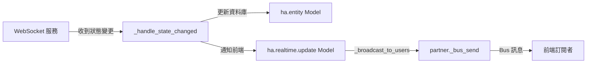

# Odoo 模型類型使用指南

## 概述

本文件說明 Odoo 中不同模型類型的特性、使用場景、初始化方式以及實際範例。

---

## 模型類型分類

Odoo 提供三種主要的模型基礎類別：

| 模型類型 | 基礎類別 | 資料持久化 | 主要用途 |
|---------|---------|-----------|---------|
| **一般模型** | `models.Model` | ✓ 永久保存 | 業務資料、主要實體 |
| **暫存模型** | `models.TransientModel` | ✗ 暫存（自動清理） | 精靈表單、即時通知、暫存處理 |
| **抽象模型** | `models.AbstractModel` | ✗ 無資料表 | 可重用的 Mixin、基礎類別 |

---

## 1. 一般模型 (Model)

### 特性

- 繼承自 `models.Model`
- 資料永久保存在資料庫
- 有對應的資料表
- 支援完整的 CRUD 操作

### 使用場景

- 業務核心資料（客戶、訂單、產品等）
- 需要長期保存的記錄
- 需要關聯查詢的實體

### 範例：HA Entity 模型

```python
from odoo import models, fields

class HaEntity(models.Model):
    """Home Assistant 實體"""
    _name = 'ha.entity'
    _description = 'Home Assistant Entity'

    entity_id = fields.Char(string='Entity ID', required=True)
    domain = fields.Char(string='Domain', required=True)
    state = fields.Char(string='State')
    friendly_name = fields.Char(string='Friendly Name')
    last_changed = fields.Datetime(string='Last Changed')
    attributes = fields.Json(string='Attributes')
    enable_record = fields.Boolean(string='Enable History Recording', default=False)
```

**資料表**：`ha_entity`
**持久化**：✓ 永久保存

---

## 2. 暫存模型 (TransientModel)

### 特性

- 繼承自 `models.TransientModel`
- 資料暫時保存，系統會定期自動清理
- 有對應的資料表（但不是永久的）
- 適合短期操作和即時通知

### 使用場景

1. **精靈表單 (Wizard)**：引導用戶完成多步驟操作
2. **即時通知**：推送前端更新（如 Bus 系統）
3. **暫存處理**：匯入匯出、批次操作的中間資料
4. **報表生成**：暫存報表參數

### 範例：HA Realtime Update 模型

> **注意**：此模型使用 `bus.listener.mixin` 最佳實踐，而非 TransientModel。

```python
from odoo import models, api, fields
import logging

_logger = logging.getLogger(__name__)

class HaRealtimeUpdate(models.Model):
    """
    Home Assistant 即時更新處理（使用 bus.listener.mixin 最佳實踐）
    廣播通知到所有登入用戶的前端
    """
    _name = 'ha.realtime.update'
    _description = 'Home Assistant Realtime Update Handler'
    _inherit = ['bus.listener.mixin']

    name = fields.Char(string='Name', default='HA Bus Notifier')

    def _bus_channel(self):
        """定義 bus channel - 返回當前用戶的 partner"""
        return self.env.user.partner_id

    @api.model
    def _broadcast_to_users(self, notification_type, message):
        """廣播通知到所有在線用戶"""
        users = self.env['res.users'].search([('id', '!=', 1)])
        for user in users:
            try:
                user.partner_id._bus_send(notification_type, message)
            except Exception as e:
                _logger.error(f"Failed to send notification to user {user.login}: {e}")

    @api.model
    def notify_entity_state_change(self, entity_id, old_state, new_state, ha_instance_id=None):
        """
        通知前端實體狀態變更

        :param entity_id: 實體 ID
        :param old_state: 舊狀態值
        :param new_state: 新狀態值
        :param ha_instance_id: HA 實例 ID (可選，用於多實例支援)
        """
        try:
            message = {
                'entity_id': entity_id,
                'old_state': old_state,
                'new_state': new_state,
                'timestamp': new_state.get('last_changed') if new_state else None,
                'ha_instance_id': ha_instance_id
            }
            self._broadcast_to_users('ha_state_changed', message)
            _logger.debug(f"Broadcast state change: {entity_id} (instance: {ha_instance_id})")
        except Exception as e:
            _logger.error(f"Failed to broadcast state change: {e}")

    @api.model
    def notify_ha_websocket_status(self, status, message, ha_instance_id=None):
        """
        通知前端 Home Assistant WebSocket 服務狀態

        :param status: 狀態 ('connected', 'disconnected', 'error', 'reconnecting')
        :param message: 狀態訊息
        :param ha_instance_id: HA 實例 ID (可選，用於多實例支援)
        """
        try:
            from datetime import datetime
            payload = {
                'status': status,
                'message': message,
                'timestamp': datetime.now().isoformat(),
                'ha_instance_id': ha_instance_id
            }
            self._broadcast_to_users('ha_websocket_status', payload)
            _logger.info(f"Broadcast WebSocket status: {status} - {message}")
        except Exception as e:
            _logger.error(f"Failed to broadcast service status: {e}")
```

**資料表**：`ha_realtime_update`
**持久化**：✓ 持久化（因為 bus.listener.mixin 需要 Model）
**設計原因**：Odoo 18 的 `bus.listener.mixin` 必須繼承自 Model，不能用 TransientModel

---

## 3. 抽象模型 (AbstractModel)

### 特性

- 繼承自 `models.AbstractModel`
- 不會建立資料表
- 用於定義可重用的欄位和方法
- 通過 `_inherit` 被其他模型繼承

### 使用場景

- Mixin 類別（提供通用功能）
- 基礎類別（定義共同欄位和行為）
- 不需要儲存資料的工具類

### 範例：通用 Mixin

```python
from odoo import models, fields

class TrackingMixin(models.AbstractModel):
    """追蹤 Mixin - 為任何模型添加追蹤欄位"""
    _name = 'tracking.mixin'
    _description = 'Tracking Mixin'

    create_date = fields.Datetime(string='Created Date', readonly=True)
    write_date = fields.Datetime(string='Last Updated', readonly=True)
    create_uid = fields.Many2one('res.users', string='Created by', readonly=True)
    write_uid = fields.Many2one('res.users', string='Last Updated by', readonly=True)
```

**使用方式**：

```python
class MyModel(models.Model):
    _name = 'my.model'
    _inherit = ['tracking.mixin']  # 繼承 Mixin

    name = fields.Char(string='Name')
    # 自動擁有 create_date, write_date 等欄位
```

---

## 模型初始化與使用

### 透過 Environment 存取

所有模型（包括 TransientModel）都透過 Odoo Environment (`env`) 來存取：

```python
# 在任何有 env 的地方
realtime_service = env['ha.realtime.update']
entity = env['ha.entity']
```

### 常見使用場景

#### 1. 在模型方法中使用

```python
class HaEntity(models.Model):
    _name = 'ha.entity'

    def send_notification(self):
        # 使用 ha.realtime.update 發送狀態變更通知
        self.env['ha.realtime.update'].notify_entity_state_change(
            self.entity_id,
            old_state={'state': self.old_state},
            new_state={'state': self.state},
            ha_instance_id=self.ha_instance_id.id
        )
```

#### 2. 在 WebSocket 服務中使用

```python
# hass_websocket_service.py - _sync_update_entity()
def _sync_update_entity(self, entity_id, new_state_data, old_state_data=None):
    """同步版本的實體更新（在背景執行緒中執行）"""
    try:
        with db.db_connect(self.db_name).cursor() as cr:
            env = api.Environment(cr, 1, {})
            # ...更新實體...

            # 通知前端狀態變更
            realtime_service = env['ha.realtime.update']
            realtime_service.notify_entity_state_change(
                entity_id,
                old_state_data,
                new_state_data,
                ha_instance_id=self.instance_id
            )
            cr.commit()
    except Exception as e:
        self._logger.error(f"Error in sync entity update: {e}")
```

#### 3. 在背景執行緒中建立 Environment

```python
from odoo.service import db
from odoo import api

def _sync_update_entity(self, entity_id, state_data):
    """同步版本的實體更新（在背景執行緒中執行）"""
    # 建立新的資料庫連線和環境
    with db.db_connect(self.db_name).cursor() as cr:
        env = api.Environment(cr, 1, {})  # 使用 admin 用戶 (uid=1)

        # 現在可以使用 env 存取模型
        entity = env['ha.entity'].search([('entity_id', '=', entity_id)], limit=1)
        realtime = env['ha.realtime.update']

        # 執行操作...
        cr.commit()  # 提交事務
```

---

## 實務應用：本專案範例

### bus.listener.mixin 在 WebSocket 整合中的角色

在本專案的 Home Assistant 整合中，`ha.realtime.update` 使用 `bus.listener.mixin` 模式：



**流程說明**：

1. **WebSocket 服務**接收到 Home Assistant 的狀態變更事件
2. **更新永久資料**：寫入 `ha.entity` (Model)
3. **即時通知**：使用 `ha.realtime.update.notify_entity_state_change()` 推送 Bus 訊息
4. **前端更新**：訂閱 Bus 的前端組件收到更新並重新渲染

### 為什麼使用 Model + bus.listener.mixin？

1. **Odoo 18 最佳實踐**：`bus.listener.mixin` 必須繼承自 Model
2. **自動訂閱**：用戶登入後自動訂閱其 partner channel
3. **官方支援**：使用 `partner._bus_send()` 而非低階 `bus.bus._sendmany()`
4. **多實例支援**：通知可附加 `ha_instance_id` 區分來源

---

## 官方文件參考

### Bus 系統與即時通知

Odoo 官方文件中關於 Event Bus 的說明：

- **前端 Bus**：`env.bus` (JavaScript EventBus)
- **後端 Bus**：`bus.bus` 模型（用於跨 process 通訊）

**範例**（來自官方文件）：

```javascript
// 前端訂閱 Bus 事件
import { useBus } from "@web/core/utils/hooks";

class MyComponent {
  setup() {
    useBus(this.env.bus, "ha_entity_update", event => {
      console.log("Entity updated:", event);
    });
  }
}
```

```python
# 後端發送 Bus 訊息
self.env['bus.bus']._sendmany([
    ('ha_entity_update', {
        'entity_id': 'sensor.temperature',
        'data': {'state': '23.5'}
    })
])
```

### TransientModel 自動清理機制

根據 Odoo 官方文件：

- **預設清理週期**：每天執行一次
- **保留時間**：通常為 1 小時到 1 天（可配置）
- **清理方法**：`_transient_vacuum()` 由 ir.cron 定期執行

---

## 最佳實踐

### 選擇正確的模型類型

```python
# ✓ 正確：業務資料使用 Model
class Customer(models.Model):
    _name = 'res.partner'
    name = fields.Char()

# ✓ 正確：即時通知使用 TransientModel
class Notification(models.TransientModel):
    _name = 'notification.handler'

    @api.model
    def send_alert(self, message):
        self.env['bus.bus']._sendmany([('alert', {'msg': message})])

# ✓ 正確：可重用邏輯使用 AbstractModel
class AuditMixin(models.AbstractModel):
    _name = 'audit.mixin'
    audit_log = fields.Text()

# ✗ 錯誤：不要用 Model 存放暫存通知
class BadNotification(models.Model):  # 會累積大量無用記錄！
    _name = 'bad.notification'
    message = fields.Char()
```

### Environment 使用注意事項

```python
# ✓ 正確：在模型方法中直接使用 self.env
def my_method(self):
    entity = self.env['ha.entity'].browse(1)

# ✓ 正確：在背景執行緒中建立新 env
with db.db_connect(db_name).cursor() as cr:
    env = api.Environment(cr, 1, {})
    entity = env['ha.entity'].browse(1)
    cr.commit()

# ✗ 錯誤：跨執行緒使用同一個 env（會導致 cursor 問題）
env = self.env  # 在主執行緒
threading.Thread(target=lambda: env['ha.entity'].search([])).start()  # 危險！
```

---

## 總結

- **Model**：永久業務資料 → `ha.entity`
- **TransientModel**：暫存操作與通知 → `ha.realtime.update`
- **AbstractModel**：可重用的 Mixin → 通用功能

選擇正確的模型類型對於系統效能和維護性至關重要。在本專案中，TransientModel 用於即時通知是最佳實踐，避免了累積大量無用的通知記錄。
