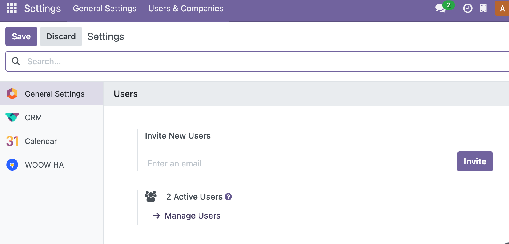
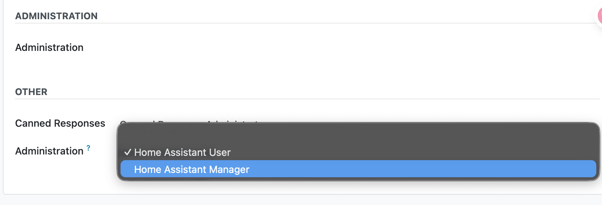
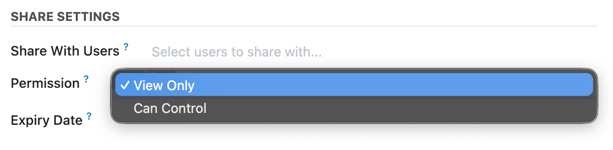
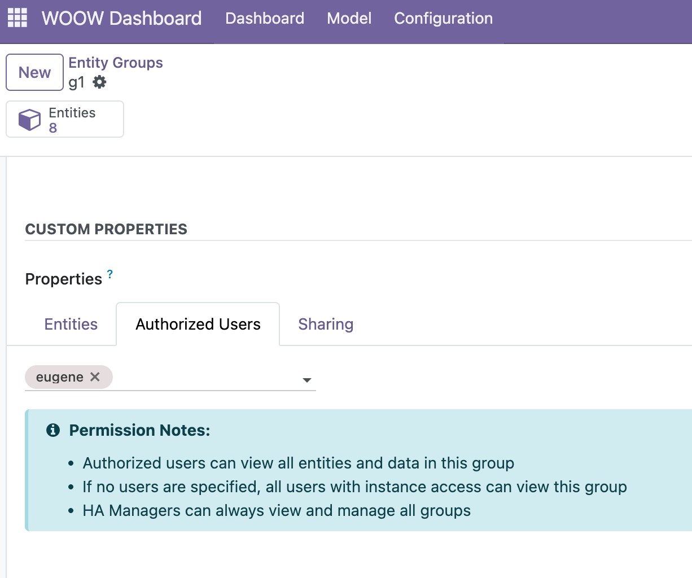
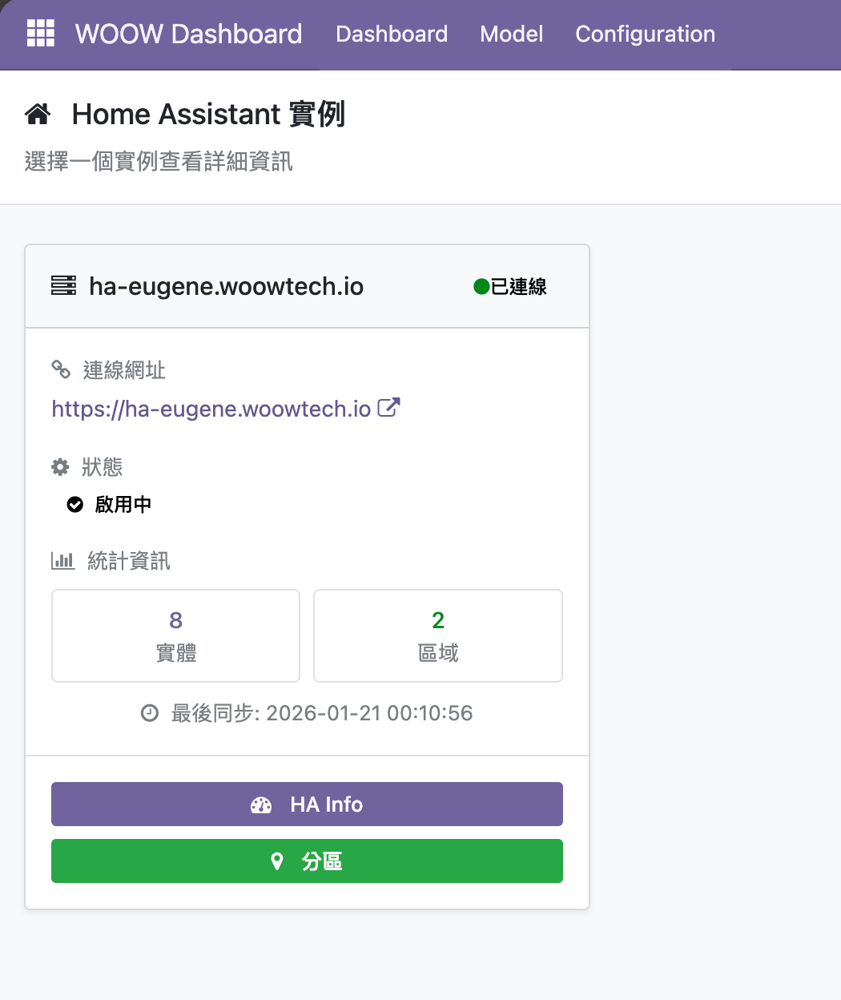
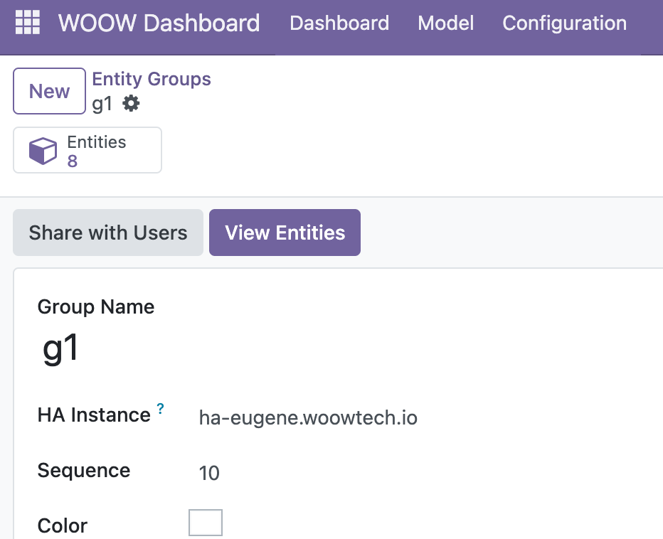
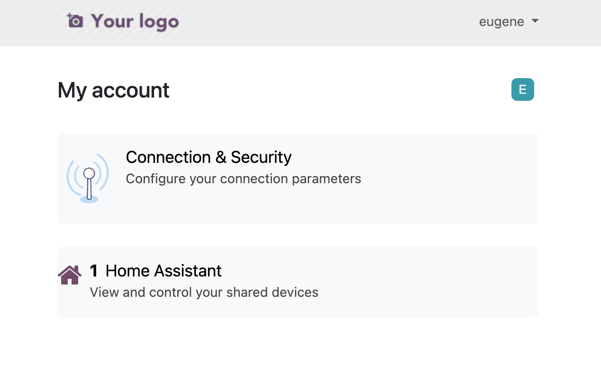

# 一般

- 有兩種 sharing 的管道：in App 和 portal 頁
- `ha_manager` / `ha_user` 身份需要由可以設定 adminstrator 身份的人進到 "Manage Users" 管理
- sharing 的授權只有兩種：_View Only_ / _Can Control_

# in App

需要由 `ha_manager` 身份的人授權給 `ha_user` 身份的人 _Entity_ / _Entity Group_

一個 user 需有，以下兩條件才可以看到 ha dashbaord：

1. `ha_user` 身份
2. _Entity_ / _Entity Group_ 有授權給該 user

# portal

只要有登入的人就可以授權，使用者可以在 portal 的 _/my_ 頁，多出 _Home Assistant_ 的入口

只要在 _Entity_ / _Entity Group_ 中 "Share with Users" 設定該使用者 permission 就可以

# 差異

|            | in App                                    | portal                                                         |
| ---------- | ----------------------------------------- | -------------------------------------------------------------- |
| 使用者口入 | apps 中的 _woow dashbaord_                | portal 中的 _/my_ 頁                                           |
| 即時性     | 快，支援websocket                         | 慢，只能 pulling                                               |
| 授權範籌   | 完整，和 ha_manager 在 app 中看到的一樣   | 受限，需要設定 _View Only_ / _Can Control_                     |
| 授權條件   | 三個，可登入、ha_user 身份、設定授權 user | 二個，可登入、設定 user + permission                           |
| 開發對象   | app 頁面                                  | 另外製做的 portal 頁面，有各 domain 有可 service call 的白名單 |
